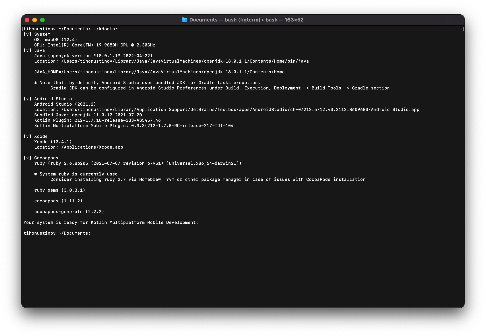
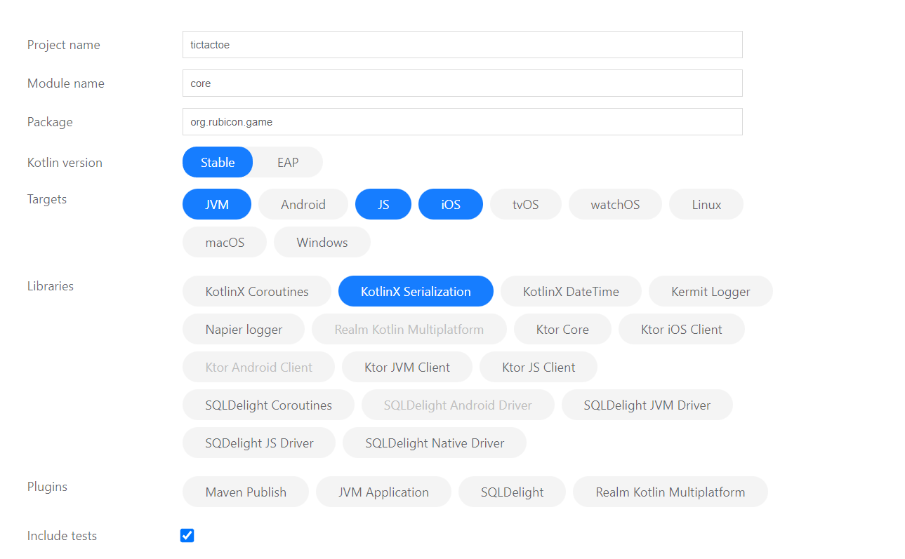
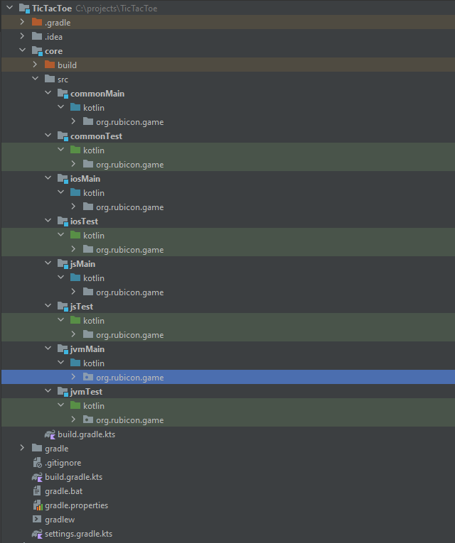
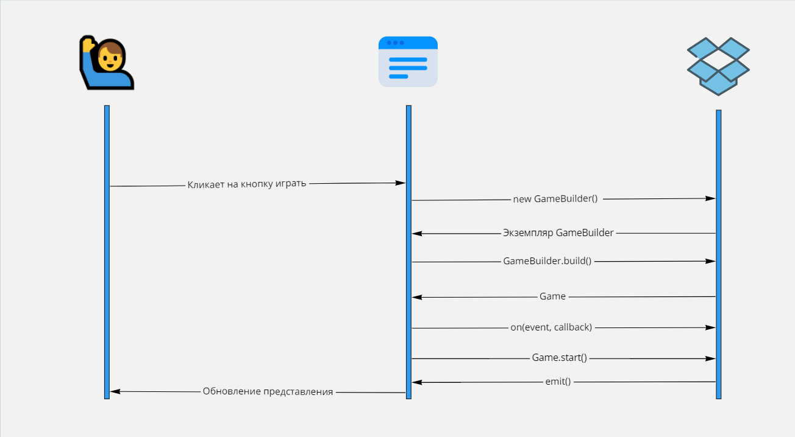
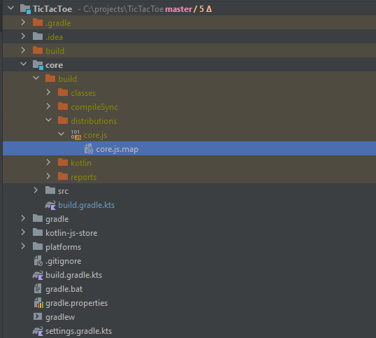
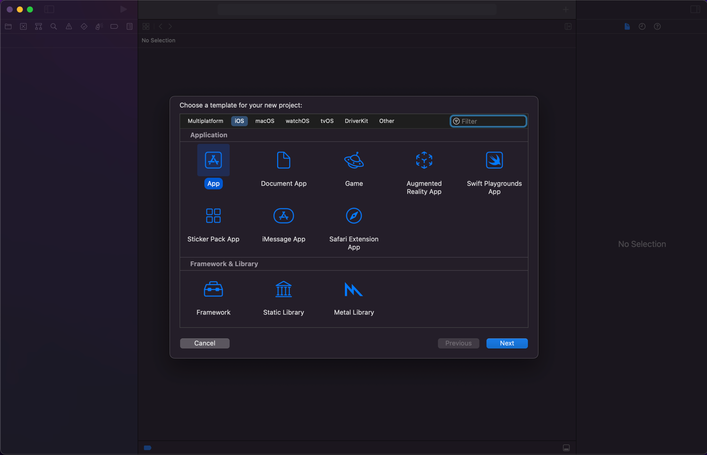
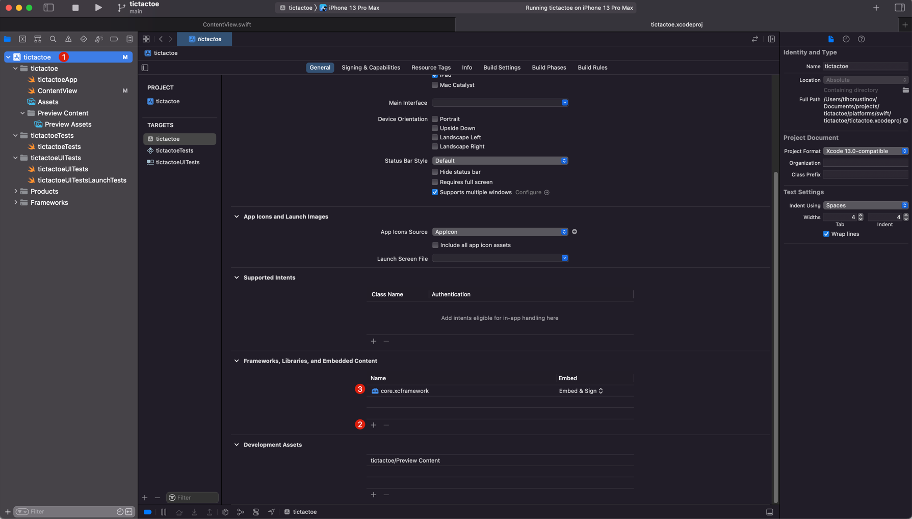

# Выходим за пределы JVM

Изначально я хотел описать свой рабочий проект, но кому будет интересна бизнес логика непонятного проекта, поэтому я решил написать простую игру с платформонезависимым сервером и клиентом на [Kotlin Multiplatform](https://kotlinlang.org/docs/multiplatform.html) и запустить ее в браузере, android приложении, ios приложении и может на desctop. 


## Идея

Для реализации самой идеи платформонезависимый игры и идея самой игры должна быть простая. Поэтому за идею возьмем всем знакомые крестики-нолики, напишем их на Kotlin и запустим на самых популярных платформах Android, iOS, Браузер с кодом платформы только для отрисовки представления.

**// TODO  Android, iOS, Браузер дубль**


## Создание проекта

#### Окружение

Для начала работы с Kotlin Multiplatform желательно проверить все необходимое окружение с помощью утилиты [KDoctor](https://github.com/Kotlin/kdoctor). После того как проверили и все есть можно смело начинать делать проект. Для корректно работы результат проверки должен быть приблизительно таким.



Вы можете использовать любое удобное для вас окружение, но помните что, чтобы разрабатывать под iOS с использованием Kotlin Multiplatform нужен Command Line Tools (обычно ставится при установки xcode), и по политики Apple данный набор инструментов можно установить только на продукцию Apple. Ну или может быть на  Hackintosh тоже получится, я не пробовал.
Скачать Command Line Tools можно с [официального сайта Apple для разработчиков](https://developer.apple.com/download/all/).


#### Создание проекта

Далее для создания проекта можно воспользоваться [Kotlin Multiplatform Wizard](https://terrakok.github.io/kmp-web-wizard/).

- Выбираем текущую стабильную версию Kotlin
- Для целевых сборок выбираем **JVM**, **JS**, **iOS** (если что-то то будет еще потом можно будет добавить)
- Среди библиотек выбираем **KotlinX Serialization** - для возможности сериализовать и десериализовать DTO
- Тесты включаем

**//TODO Сериализация может не понадобиться **

  Должна получиться приблизительно такая конфигурация.




Далее скачиваем и разархивируем в вашу рабочую область. И открываем в вашей любимой IDE, но лучше использовать IntelliJ IDEA, так как в ней есть некоторые вспомогательные функции для работы с Kotlin Mitiplatform,  например при создании классов которые будут реализованы под каждую платформу ide поможет сгенерировать эти классы.

После того как вы открыли проект у вас должна быть такая структура проекта с первоначальным кодом. 

```text
- commonMain
  - kotlin
    - org.rubicon.game
      - Platform.kt
- commonTest
  - kotlin
    - org.rubicon.game
      - CommonTest
- iosMain
  - kotlin
    - org.rubicon.game
      - Platform.kt
- iosTest
  - kotlin
    - org.rubicon.game
      - PlatformTest
- jsMain
  - kotlin
    - org.rubicon.game
      - Platform.kt
- jsTest
  - kotlin
    - org.rubicon.game
      - PlatformTest
- jvmMain
  - kotlin
    - org.rubicon.game
      - Platform.kt
- jvmTest
  - kotlin
    - org.rubicon.game
      - PlatformTest
```


Файлы Platform.kt, CommonTest, PlatformTest сразу удалим так как они нам не понадобятся. И по итогу должна получиться вот такая структура проекта.




#### Настройка сборки

Для начала в файле *./settings.gradle.kts* явно укажем версию kotlin multiplatform.

  *./settings.gradle.kts*

```kotlin
pluginManagement {
    repositories {
        google()
        gradlePluginPortal()
        mavenCentral()
    }
    // Укажем явно так как в боле ранних версиях есть была ошибка при создании *d.ts компилятором IR
    plugins {
        kotlin("multiplatform") version "1.7.10"
    }
}

rootProject.name = "tictactoe"
include(":core")
```


И добавим пару строчек в свойства сборки.

*./gradle.properties*

```properties
# Добавляем группу и версию остальное оставляем без зменений
group=ru.tikhon.tictactoe
version=1.0.0

# Остальное можно оставить так как есть
#Gradle
org.gradle.jvmargs=-Xmx2048M -Dkotlin.daemon.jvm.options\="-Xmx2048M"

#Kotlin
kotlin.code.style=official

#MPP
kotlin.mpp.enableCInteropCommonization=true
```


Далее идем настраивать параметры сборки под конкретный платформы в файле *./core/build.gradle.kts*.

*./core/build.gradle.kts*

**//TODO добавить по завершению проекта** 


## Написание кода

#### Проектирование

Для работы мультиплатформенности наш код должен удовлетворять следующим характеристикам:

- Должен быть полный набор классов необходимый для реализации игры
- Этот набор классов не должен зависеть от какой либо платформы

Логика работы должна быть приблизительно такая:

1) Пользователь кликает кнопку играть
2) Создается экземпляр GameBuilder из SDK
3) Заполняются необходимые данные для построения игры (могут быть имена игроков)
4) У экземпляра объекта GameBuilder вызывается метод build 
5) SDK создает экземпляра класса Game и возвращает ее на сторону платформы 
6) На стороне платформы создаются подписки на обновления (начало игры, конец игры, смена хода, отрисовка крестиков и ноликов)
7) У экземпляра Game вызывается метод start 
8) SDK кидает события чтобы платформа отрисовала нужные UI элементы
9) И начинается игра

**//TODO Подправить схему**




## Код

### Реализация SDK

После того как все готово можно приступать к написанию кода. В основном код будет писаться в **commonMain** и там будут располагаться классы которые потом будут использоваться уже на платформах где будет запускаться наша игра.

По задуманной логике обновление представление должно происходить по событию, а это значить нужно создать класс который будет уметь принимать слушателей и уметь кидать события, этот класс назовем **EventEmitter** а его интерфейс **IEventEmitter**.

Но события в нашей модели тоже должны нести некоторую информацию, например если представление подпишется на изменение состояния поля, при срабатывании подписки одно должно знать где именно был поставлен крестик или нолик. Поэтому сначала объявим **IEvent** и реализуем его имплементацию **Event**.

interface *core/src/commonMain/kotlin/org/rubicon/game/IEvent.kt*

```kotlin
package org.rubicon.game

import kotlin.js.JsExport

/**
 * Событие, которое получит пользователь при срабатывании подписки
 * @property type Тип события
 * @property source Источник события
 */
@JsExport
interface IEvent<T : Enum<T>, S> {
    val type: T
    val source: S

    /**
     * Данный метод при деструктуризации вернет тип события
     * */
    operator fun component1(): T = this.type

    /**
     * Данный метод при деструктуризации вернет источник события
     * */
    operator fun component2(): S = this.source
}
```

class *core/src/commonMain/kotlin/org/rubicon/game/impl/events/Event.kt*

```kotlin
package org.rubicon.game.impl.events

import org.rubicon.game.IEvent
import kotlin.js.JsExport

@JsExport
open class Event<T: Enum<T>, S>(
    override val type: T,
    override val source: S
) : IEvent<T, S>
```

После реализации события можем перейти к объявлению **IEventEmitter** и его реализации **EventEmitter**.

В объявлении **IEventEmitter** используется 3 обобщенных типа

- T - это тип события, который может быть только перечисляемым типом
- S - это источник события

Interface *./core/src/commonMain/kotlin/org/rubicon/game/IEventEmitter.kt*

```kotlin
package org.rubicon.game

import kotlin.js.JsExport


@JsExport
class DuplicateListenersException(override val message: String) : Throwable(message)

/**
 * Тип подписки
 * данная функция обратного вызова должна принимать на вход событие
 * с которым она и будет работать
 * */
typealias EventCallBack<T, S> = (IEvent<T, S>) -> Unit

/**
 * Создает возможность подписываться на события объекта
 * */
@JsExport
interface IEventEmitter<T : Enum<T>, S> {
    /**
     * Создать подписку
     * */
    @Throws(DuplicateListenersException::class)
    fun on(eventType: T, callBack: EventCallBack<T, S>)

    /**
     * Удалить подписку
     * */
    fun del(eventType: T, callBack: EventCallBack<T, S>)

    /**
     * Создать подписку, которая будет удалена после срабатывания события
     * */
    fun once(eventType: T, callBack: EventCallBack<T, S>)
}
```

class *core/src/commonMain/kotlin/org/rubicon/game/impl/events/EventEmitter.kt*

```kotlin
package org.rubicon.game.impl.events

import org.rubicon.game.DuplicateListenersException
import org.rubicon.game.EventCallBack
import org.rubicon.game.IEvent
import org.rubicon.game.IEventEmitter
import kotlin.js.JsExport

@JsExport
abstract class EventEmitter<T : Enum<T>, S> : IEventEmitter<T, S> {
    private val listeners: LinkedHashMap<T, ArrayList<EventCallBack<T, S>>> = linkedMapOf()

    override fun on(eventType: T, callBack: EventCallBack<T, S>) {
        val eventTypeCollection = listeners.getOrPut(eventType) {
            arrayListOf()
        }
        if (callBack in eventTypeCollection) {
            throw DuplicateListenersException("Данная подписка уже существует.")
        }
        eventTypeCollection.add(callBack)
    }

    override fun del(eventType: T, callBack: EventCallBack<T, S>) {
        listeners[eventType]?.remove(callBack)
    }

    override fun once(eventType: T, callBack: EventCallBack<T, S>) {
        this.on(eventType) {
            this.del(eventType, callBack)
            callBack(it)
        }
    }

    protected fun emit(event: IEvent<T, S>) {
        listeners[event.type]?.forEach {
            it(event)
        }
    }
}
```

Теперь простым наследованием мы можем научить любой класс кидать события и можем перейти к созданию главного класса игры **Game**. Так как наш класс должен должен быть наследником **EventEmitter** а он требует указания перечисления событий то сделаем это, создадим перечисление событий игры.

Соответственно события которые могут возникнуть во время игры 

- окончание игры когда какая-то сторона выиграла или не осталось ходов
- событие изменения ячейки игрового поля, когда там будут ставит крестики или нолики

enum *core/src/commonMain/kotlin/org/rubicon/game/impl/events/GameEventType.kt*

```kotlin
package org.rubicon.game.impl.events

import kotlin.js.JsExport

/**
 * События, которые могут случиться во время игры
 * */
@JsExport
enum class GameEventType {
    /**
     * Игра окончена
     * */
    GAME_OVER,
    /**
     * Изменилось состояние поля
     * */
    CHANGE_CELL
}
```

Теперь у нас есть все, чтобы объявить интерфейс **IGame** и указать методы которые можно будет вызывать на стороне представления.

interface *core/src/commonMain/kotlin/org/rubicon/game/IGame.kt*

```kotlin
package org.rubicon.game

import org.rubicon.game.impl.events.GameEventType
import kotlin.js.JsExport

/**
 * Игра
 * Реализует главную логику игры кидает события по окончанию игры или при изменении состояния игрового поля
 * */
@JsExport
interface IGame : IEventEmitter<GameEventType, IGame> {
    /**
     * Запускает игру
     *
     * Кидает события об изменении каждой игровой ячейки для отрисовки поля
     * */
    fun play()

    /**
     * Сбрасывает состояние игры
     * */
    fun reset()
}
```

Но для непосредственной реализации нам не хватает еще четырех сущностей

- **PlayerType** перечисляемый класс обозначающий игрока, крестик, нолик или его отсутствие
- **IFieldCell** элемент который будет отвечать за квадратик с крестиком или ноликом на игровом поле
- **GameCellEvent** событие изменения состояния ячейки игрового поля с указанием этой самой ячейки
- **GameOverEvent** событие окончания с указанием победителя

 

enum *core/src/commonMain/kotlin/org/rubicon/game/impl/PlayerType.kt*

```kotlin
package org.rubicon.game.impl

import kotlin.js.JsExport

/**
 * Тип игрока
 * */
@JsExport
enum class PlayerType {
    /**
     * Игрок отсутствует
     * */
    NONE,
    /**
     * Игрок, который играет крестиками
     * */
    CROSS,
    /**
     * Игрок, который играет ноликами
     * */
    ZERO
}
```

interface *core/src/commonMain/kotlin/org/rubicon/game/IFieldCell.kt*

```kotlin
package org.rubicon.game

import org.rubicon.game.impl.PlayerType
import kotlin.js.JsExport

/**
 * Элемент игрового где должны отображаться крестики и нолики
 * */
@JsExport
interface IFieldCell {
    /**
     * При клике меняется состояние кнопки на состояние активного игрока
     * */
    fun click()

    /**
     * Возвращает значение каким игроком было нажато
     * */
    fun getState(): PlayerType

    /**
     * Возвращает координату по оси X
     * */
    fun getX(): Int

    /**
     * Возвращает координату по оси Y
     * */
    fun getY(): Int
}
```

И сразу же реализуем эту игровую ячейку **FieldCell**.

class *core/src/commonMain/kotlin/org/rubicon/game/impl/FieldCell.kt*

```kotlin
package org.rubicon.game.impl

import org.rubicon.game.IFieldCell
import org.rubicon.game.impl.events.Event
import org.rubicon.game.impl.events.EventEmitter
import kotlin.js.JsExport

@JsExport
enum class FieldCellEvents {
    CLICK
}

@JsExport
class FieldCell(
    private val x: Int,
    private val y: Int,
    private var state: PlayerType = PlayerType.NONE
) : EventEmitter<FieldCellEvents, FieldCell>(), IFieldCell {

    /**
     * Во время игры состояние может быть изменено либо сброшено
     * */
    internal fun changeState(state: PlayerType) {
        this.state = state
    }

    override fun click() {
        // Мы кинем событие, что пользователь кликнул только если уже не кликнуто раньше
        if (this.state == PlayerType.NONE) {
            this.emit(Event(FieldCellEvents.CLICK, this))
        }
    }

    override fun getState(): PlayerType = this.state

    override fun getX(): Int = this.x
    override fun getY(): Int = this.y
}
```

class *core/src/commonMain/kotlin/org/rubicon/game/impl/events/GameCellEvent.kt*

```kotlin
package org.rubicon.game.impl.events

import org.rubicon.game.IGame
import org.rubicon.game.impl.FieldCell
import kotlin.js.JsExport

@JsExport
class GameCellEvent(
    source: IGame,
    val fieldCell: FieldCell
) : Event<GameEventType, IGame>(GameEventType.CHANGE_CELL, source)
```

class *core/src/commonMain/kotlin/org/rubicon/game/impl/events/GameOverEvent.kt*

```kotlin
package org.rubicon.game.impl.events

import org.rubicon.game.IGame
import org.rubicon.game.impl.FieldCell
import org.rubicon.game.impl.PlayerType
import kotlin.js.JsExport

@JsExport
class GameOverEvent(
    game: IGame,
    winLine: List<FieldCell>? = null
) : Event<GameEventType, IGame>(GameEventType.GAME_OVER, game) {
    val winLine = winLine?.toTypedArray()
    val winner: PlayerType = winLine?.first()?.getState() ?: PlayerType.NONE
}
```

И теперь можем перейти к последнему классу в SDK **Game** и реализовать его. В этом классе будет основная логика игры такая как проверка победы, изменение состояний **FieldCell** и создание событий об изменении этих состояний.

class *core/src/commonMain/kotlin/org/rubicon/game/impl/Game.kt*

```kotlin
package org.rubicon.game.impl

import org.rubicon.game.IEvent
import org.rubicon.game.IGame
import org.rubicon.game.impl.events.EventEmitter
import org.rubicon.game.impl.events.GameCellEvent
import org.rubicon.game.impl.events.GameEventType
import org.rubicon.game.impl.events.GameOverEvent
import kotlin.js.JsExport

@JsExport
class Game : EventEmitter<GameEventType, IGame>(), IGame {
    // Сразу инициализируем поле 3 x 3 и подписываемся на событие клика
    private val field: List<List<FieldCell>> = List(3) { y ->
        List(3) { x ->
            FieldCell(x, y).also {
                it.on(FieldCellEvents.CLICK, this::onClickFieldCell)
            }
        }
    }

    // Первым ходят крестики
    private var playerType: PlayerType = PlayerType.CROSS
    private val winConditions: List<List<FieldCell>> by lazy {
        this.getAllWinConditions()
    }

    private fun onClickFieldCell(event: IEvent<FieldCellEvents, FieldCell>) {
        if (this.playerType != PlayerType.NONE) {
            val fieldCell: FieldCell = event.source
            this.changeFiledCellState(fieldCell, playerType)
            this.turnMove()
            this.checkGameOver()
        }
    }

    private fun changeFiledCellState(fieldCell: FieldCell, state: PlayerType) {
        fieldCell.changeState(state)
        this.emit(GameCellEvent(this, fieldCell))
    }

    private fun turnMove() {
        this.playerType = when (playerType) {
            PlayerType.CROSS -> PlayerType.ZERO
            PlayerType.ZERO,
            PlayerType.NONE -> PlayerType.CROSS
        }
    }

    private fun checkGameOver() {
        val winLine = this.winConditions.find { this.isMatchLine(it) }
        val event = when {
            winLine != null -> GameOverEvent(this, winLine)
            !hasFreeCells() -> GameOverEvent(this)
            else -> null
        }
        if(event != null) {
            this.playerType = PlayerType.NONE
            this.emit(event)
        }
    }

    private fun hasFreeCells(): Boolean {
        return this.field.any { row ->
            row.any { it.getState() == PlayerType.NONE }
        }
    }

    private fun isMatchLine(row: List<FieldCell>): Boolean {
        if (row.isEmpty()) return false
        val firstState = row.first().getState()
        if (firstState == PlayerType.NONE) return false
        return row.all { it.getState() == firstState }
    }

    private fun getAllWinConditions(): List<List<FieldCell>> {
        val result: ArrayList<List<FieldCell>> = arrayListOf()
        val diagonal: ArrayList<FieldCell> = arrayListOf()
        val diagonalOpposite: ArrayList<FieldCell> = arrayListOf()
        for (i in 0..2) {
            // Добавляем все строчки
            result.add(
                listOf(
                    this.field[i][0],
                    this.field[i][1],
                    this.field[i][2],
                )
            )
            // Добавляем все колонки
            result.add(
                listOf(
                    this.field[0][i],
                    this.field[1][i],
                    this.field[2][i],
                )
            )
            diagonal.add(this.field[i][i])
            diagonalOpposite.add(this.field[2 - i][i])
        }
        result.add(diagonal)
        result.add(diagonalOpposite)
        return result
    }

    override fun play() {
        // Суть метода заключается в том чтобы отрисовать ячейки игрового поля
        // Поэтому reset сюда подходит
        this.reset()
    }

    override fun reset() {
        this.playerType = PlayerType.CROSS
        for (y in 0 until this.field.size) {
            for (x in 0 until this.field[y].size) {
                this.changeFiledCellState(this.field[y][x], PlayerType.NONE)
            }
        }
    }

}
```

Все, SDK готово, а это значит можем начинать использовать его на всех платформах в которые может компилироваться Kotlin, и начнем с JS.

### Реализация использования SDK на платформах

#### Реализация на JS

Для того чтобы получить итоговую сборку под платформу JS нужно выполнить команду gradle **jsBrowserProductionWebpack**.

```bash
./gradlew jsBrowserProductionWebpack
```

После чего у вас должен появиться js файл с названием модуля **core.js**.



Который будет содержать все написанные нами ранее классы только написанные уже на JS. И теперь чтобы игра окончательно заработала осталось только прикрутить представление. Обойдемся одним файлом в котором реализуем сразу 

index.js

```html
<!DOCTYPE html>
<head>
    <meta charset="UTF-8">
    <title>Tic Tac Toe</title>
    <script src="../../core/build/distributions/core.js"></script>
    <style>
        .field {
            display: flex;
            flex-wrap: wrap;
            align-content: flex-start;
            width: 900px;
            height: 900px;
            background-color: #e6e6e6;
            border-radius: 10px;
            padding: 10px 0 0 10px;

        }

        .field-cell {
            color: black;
            width: 290px;
            height: 290px;
            background-color: #a7c6c6;
            margin: 0 10px 10px 0;
            border-radius: 10px;
            cursor: pointer;
        }
    </style>
</head>
<!-- Сюда будем выводить результат с кнопкой перезапуска -->
<div id="result"></div>
<!-- Главное поле сюда при рендере закинем ячейки поля -->
<div class="field" id="field"></div>
<body>
<script>
    // Иконки крестиков и ноликов которые будем выводить в ячейки
    const crossSVG = `
        <svg class="svg-icon"
             style="width: 100%; height: auto;vertical-align: middle;fill: currentColor;overflow: hidden;"
             viewBox="0 0 1024 1024" version="1.1" xmlns="http://www.w3.org/2000/svg">
            <path d="M810.65984 170.65984q18.3296 0 30.49472 12.16512t12.16512 30.49472q0 18.00192-12.32896 30.33088l-268.67712 268.32896 268.67712 268.32896q12.32896 12.32896 12.32896 30.33088 0 18.3296-12.16512 30.49472t-30.49472 12.16512q-18.00192 0-30.33088-12.32896l-268.32896-268.67712-268.32896 268.67712q-12.32896 12.32896-30.33088 12.32896-18.3296 0-30.49472-12.16512t-12.16512-30.49472q0-18.00192 12.32896-30.33088l268.67712-268.32896-268.67712-268.32896q-12.32896-12.32896-12.32896-30.33088 0-18.3296 12.16512-30.49472t30.49472-12.16512q18.00192 0 30.33088 12.32896l268.32896 268.67712 268.32896-268.67712q12.32896-12.32896 30.33088-12.32896z"/>
        </svg>
    `;
    const circleSymbol = `
        <svg class="svg-icon"
             style="width: 100%; height: auto;vertical-align: middle;fill: currentColor;overflow: hidden;"
             viewBox="0 0 1024 1024" version="1.1" xmlns="http://www.w3.org/2000/svg">
            <path d="M512 85.333333a426.666667 426.666667 0 1 0 426.666667 426.666667A426.666667 426.666667 0 0 0 512 85.333333z m0 768a341.333333 341.333333 0 1 1 341.333333-341.333333 341.333333 341.333333 0 0 1-341.333333 341.333333z"/>
        </svg>
    `;

    /**
     * Обращаемся к SDK импортируем то что будем использовать для создания игры
     * */
    const sdk = window.core.org.rubicon.game.impl
    const {Game, PlayerType} = sdk
    const {GameEventType} = sdk.events

    /**
     * Обработчик события окончания игры
     * */
    function gameOver(event) {
        const {winner, source} = event
        const winnerText = document.createElement("H3")
        switch (winner) {
            case PlayerType.NONE:
                winnerText.innerText = "Ничья"
                break
            case PlayerType.CROSS:
                winnerText.innerText = "Выиграли крестики"
                break
            case PlayerType.ZERO:
                winnerText.innerText = "Выиграли нолики"
                break
        }
        const resultElement = document.getElementById("result")
        const repeatButton = document.createElement("button")
        repeatButton.innerText = "Играть еще раз"
        repeatButton.addEventListener("click", () => {
            source.reset()
            resultElement.innerHTML = ""
        })
        resultElement.appendChild(winnerText)
        resultElement.appendChild(repeatButton)
    }

    /**
     * Обработчик события изменения состояния ячейки игрового поля
     * */
    const buttonMap = new Map()
    function updateView(event) {
        const {fieldCell} = event
        const cellHash = `${fieldCell.getY()}-${fieldCell.getX()}`
        if (!buttonMap.has(cellHash)) {
            const htmlCell = document.createElement("div")
            htmlCell.classList.add("field-cell")
            htmlCell.addEventListener("mousedown", () => fieldCell.click())
            document.getElementById("field").appendChild(htmlCell)
            buttonMap.set(cellHash, htmlCell)
        }
        const uiElement = buttonMap.get(cellHash)
        switch (fieldCell.getState()) {
            case PlayerType.NONE:
                uiElement.innerHTML = ""
                break
            case PlayerType.CROSS:
                uiElement.innerHTML = crossSVG
                break
            case PlayerType.ZERO:
                uiElement.innerHTML = circleSymbol
                break
        }
    }

    /**
     * Теперь просто создаем игру
     * */
    const game = new Game()
    /**
     * Подписываемся на события
     * */
    game.on(GameEventType.GAME_OVER, gameOver)
    game.on(GameEventType.CHANGE_CELL, updateView)
    /**
     * И запускаем
     * */
    game.play()
</script>
</body>
</html>
```

И вот так просто мы интегрировали написанный на Kotlin код в JS пример и получили вот такой замечательный результат.


Теперь сделаем то же самое для приложения под iOS.

#### Реализация на Swift

Прежде чем создавать приложение нужно скомпилировать и собрать наш Kotlin код в Framework с которым будет дружить Xcode, давайте этим и займемся. 

```bash
./gradlew linkReleaseFrameworkIosArm64 linkReleaseFrameworkIosX64 &&
xcodebuild -create-xcframework \
    -framework ./core/build/bin/iosArm64/releaseFramework/GAMEFramework.framework \
    -framework ./core/build/bin/iosX64/releaseFramework/GAMEFramework.framework \
    -output ./core/build/bin/core.xcframework
```

Полученный в итоге сборки фреймворк нужно будет добавить в созданное ios приложение, чтобы получить возможность использовать классы написанные на kotlin в swift приложении.

Теперь можем перейти к реализации приложения на swift для этого создадим простое iOS приложение.



Соответственно указываем название приложение и наименование организации и выбираем интерфейс **SwiftUI**


Далее идем в настройки проекта, для того чтобы подключить созданный нами ранее framework. 

1) Первый шаг кликаем на название проекта, чтобы перейти к его настройкам
2) Далее кликаем **+** в пункте **Frameworks, Libraries and Embedded content**.
    В открывшемся окне нажимаем **Add other** и выбираем созданную ранее папку *./core/build/bin/core.xcframework*
3) Если все сделано правильно наш framework должен появиться в таблице



Теперь при написании кода у наз должен быть доступен для импорта фреймворк с названием соответствующий baseName который мы указали в *./core/build.gradle.kts*. Но давайте эе это проверим и напишем уже реализацию данной игры под ios. Для этого переходим в файл **ContentView** который автоматически создал Xcode при создании проекта. И напишем там вот такой вот код.

*ContentView.swift*

```swift
import SwiftUI
// Импортируем наш SDK который мы написали на Kotlin
import GAMEFramework

// Создаем класс для работы с SDK и чтобы View обновляла данные смотря на него
class GameUI : ObservableObject {
    // Переменные которые будут отображаться во view
    @Published var isGameOver: Bool = false
    @Published var isGameStarted: Bool = false
    @Published var winnerName: String = ""
    @Published var field: [[String]] = [
        [" ", " ", " "],
        [" ", " ", " "],
        [" ", " ", " "]
    ]
    // Игра
    private let game: Game = Game()
    // Ячейки поля
    private var gameCells: [String: FieldCell] = [:]

    // По нажатии кнопки играть вызывается этот метод
    func start () {
        do {
            // Подписываемся на события обновления ячеек и окончания игры
            try game.on(eventType: .changeCell, callBack: onChangeCell)
            try game.on(eventType: .gameOver, callBack: onGameOver)
        } catch {
            print("Ошибка")
        }
        // Запускаем процесс игры
        game.play()
        isGameStarted = true
    }

    func playAgain() {
        isGameOver = false
        game.reset()
    }

    // view будет говорить какая кнопка была нажата,
    // а этот метод будут уже вызывать соответствующий метод у ячеки поля из SDK
    func clickButton(x: Int, y: Int) {
        if (isGameOver || !isGameStarted) {
            return
        }
        // Получаем FieldCell и вызываем у него click
        gameCells[makeHash(x: x, y: y)]?.click()
    }

    // Обработчик событий изменения состояние ячейки игрового поля
    private func onChangeCell(event: IEvent) {
        // Получаем ячеку из события
        let fieldCell = (event as! GameCellEvent).fieldCell
        // Создаем хеш и сохраняем в мапу для более удобного поиска в дальнейшем
        let hash = makeHash(x: Int(fieldCell.getX()), y: Int(fieldCell.getY()))
        if (!gameCells.keys.contains(hash)) {
            gameCells[hash] = fieldCell
        }
        // и обновляем состояние чтобы view обновлял ячейку которая изменилась
        field[Int(fieldCell.getY())][Int(fieldCell.getX())] = stateToString(state: fieldCell.getState())
    }

    // Обработчик окончания игры
    private func onGameOver(event: IEvent) {
        // Ставим значения окончания игры чтобы игрок больше не мог кликать кнопки
        isGameOver = true
        // И записываем выигравшую сторону
        switch ((event as! GameOverEvent).winner) {
        case .zero:
            winnerName = "O победили"
        case .cross:
            winnerName = "X победили"
        default:
            winnerName = "Ничья"
        }
    }

    // Преобразуем состояние ячеки в строку которая будет выводиться в кнопке
    private func stateToString(state: PlayerType) -> String {
        switch state {
        case .cross:
            return "X"
        case .zero:
            return "O"
        default:
            return " "
        }
    }

    private func makeHash(x: Int, y: Int) -> String {
        return String(x) + "-" + String(y)
    }
}

// Реализуем отображение
struct ContentView: View {
    @ObservedObject var gameUI = GameUI()
    var body: some View {
        VStack(alignment: .center) {
            ForEach((0...2), id: \.self) { y in
                HStack(spacing: 5) {
                    Group {
                        ForEach((0...2), id: \.self) { x  in
                            Button(action: { gameUI.clickButton(x: x, y: y) }) {
                                Text(gameUI.field[y][x])
                            }
                        }
                    }
                    .frame(maxWidth:.infinity)
                    .padding()
                    .foregroundColor(Color.black)
                    .font(.system(size: 64, weight: .bold, design: .default))
                    .background(Color(red: 0.654, green: 0.654, blue: 0.776))
                    .cornerRadius(5)
                }
            }.opacity(gameUI.isGameStarted ? 1 : 0)
            Group {
                Text(gameUI.winnerName)
                Button("again", action: gameUI.playAgain)
            }.opacity(gameUI.isGameOver ? 1 : 0)
            Button("play", action: gameUI.start)
                .font(.system(size: 32, weight: .bold, design: .default))
                .opacity(gameUI.isGameStarted ? 0 : 1)
        }
    }
}

struct ContentView_Previews: PreviewProvider {
    static var previews: some View {
        ContentView()
    }
}
```

Теперь запускаем и получаем вот такой вот результат.


#### Реализация на Java

Сейчас речь пойдет о мобильном приложении под Android, и по-хорошему нужно использовать Kotlin для разработки мобильных 
приложений под Android как [объявил Google](https://developer.android.com/kotlin/first) в 2019 году, 
но мы напишем на Java, чтобы продемонстрировать как наш SDK с ней дружит.


