# Выходим за пределы JVM

Какой есть общий недостаток у мобильной разработки, front-end разработки и back-end разработки и иногда распила
микросервисов? Дублирование логики, очень часто видел стати или новости, где одна команда мобильных разработчиков ждет
другую, чтобы выкатить релиз. И если с мобильными более менее все понятно и есть решения, но что делать с браузером?
Очень часто логику работы приложения так же нужно поддержать и там. Но что делать если хочется писать нативный код и при
этом не иметь дублей реализаций? На этот вопрос я постараюсь ответить подробно в данной статье, в процессе чтения
которой можно будет познакомиться с технологией Kotlin Multiplatform и создать полноценный проект всем известной игры
Крестики-Нолики на трех самых популярных платформах, таких как JS, iOS, Java с общей логикой на Kotlin.

## Содержание

- [Об авторе](#Об-авторе)
- [Почему именно Kotlin Multiplatform](#Почему-именно-Kotlin-Multiplatform)
- [Практика](#Практика)
    - [Создание проекта](#Создание-проекта)
        - [Окружение](#Окружение)
        - [Создание проекта](#Создание-проекта)
        - [Настройка сборки](#Настройка-сборки)
    - [Написание кода](#Написание-кода)
        - [Проектирование](#Проектирование)
    - [Код](#Код)
        - [Реализация SDK](#Реализация-SDK)
    - [Реализация использования SDK на платформах](Реализация-использования-SDK-на-платформах)
        - [Реализация на JS](#Реализация-на-JS)
        - [Реализация на Swift](#Реализация-на-Swift)
        - [Реализация на Java](#Реализация-на-Java)
- [Итог](#Итог)

## Об авторе

Для начала нужно наверное представиться, чтобы было понимание, что я ~~повидал некоторое дерьмо~~ накопил опыт работы с
технологией о которой пишу. Итак, начнем, меня зовут Устинов Тихон и работаю я [Ростелеком ИТ](https://rtkit.ru/) (
дочерняя компания Ростелеком, попрошу не путать), а если быть точнее на проекте
Интеграция [ЕПК](https://rtkit.ru/products/edinii-produktovii-katalog). И с помощью нашего проекта прошлом году
Ростелеком запустил проект Гибких пакетов. Где мы разработали SDK который обрабатывает всю бизнес-логику от
конфигурирования до просчета цены. Скриншот ниже это пример как одна из витрин отображает работу этого SDK. Так же с
работой этого SDK вы можете столкнуться в личном кабинете на сайте и мобильном приложении, или когда придете в офис
продаж, где человек который будет настраивать вам что-либо, будет делать это средствами SDK.


## Почему именно Kotlin Multiplatform

Перед тем как выбрать Kotlin Multiplatform мы рассматривали все возможные варианты позволяющие решить проблему запуска
одного кода в браузере и на телефонах, запуск кода на сервере оказался итоговым приятным бонусом. И если рассматривать
проблему ограничиваясь мобильными устройствами и браузером, то первое, что приходит в голову это React Native и
Progressive Web Applications (PWA), но мы уже имели некоторую базы нативных приложений от которых не хотелось
отказываться, и webview выглядел тоже не лучшим вариантом. Так же причина наличия нативных приложений отмела идею
написать на flutter, который помимо запуска на ios и android дает возможность скомпилировать код в js. Наличие нативных
приложений сократило наш выбор до двух вариантов C/C++ библиотека с подключением к нативным приложениям и к js как
webassembly и неизвестный тогда Kotlin Multiplatform. Честно говоря, отсутствие специалистов по C/C++ сократило наши
варианты до одного, и как вы уже поняли это оказался Kotlin Multiplatform. Но сразу скажу что ни разу не пожалели об
этом выборе. Хоть и при выборе технологии мы не учитывали возможность работы кода на серверной стороне, но как оказалось
данная возможность не должна игнорироваться при принятии подобных вопросах, так как при разработке API зачастую тоже
может быть код дублирующий некоторые алгоритмы или как минимум объекты которые используются для
сериализации и десериализации будут одинаковы на всех платформах.

Думаю с историей о том, как и почему мы выбрали Kotlin Multiplatform более менее понятно. Так что вкратце для тех кто не
знаком расскажу о технологии и плюсы мы выделили для себя при работе с этой технологией.

Если своими словами, то [Kotlin Multiplatform](https://kotlinlang.org/docs/multiplatform.html) это технология, которая
принадлежит компании JetBrains, позволят писать общий код на Kotlin и компилировать его в нативное представление более
чем [10 платформ](https://kotlinlang.org/docs/multiplatform-dsl-reference.html#targets). То есть после компиляции мы
будем иметь для JVM .*jar библиотеку, для JS .js модуль с возможностью создания *d.ts, и простите за тавтологию
фреймворк типа *.framework, ну или для некоторых других платформ так же могут быть созданы нативные для платформы
сущности.

Так же пока идет речь о самой технологии, особо хочется отметить хорошую документацию проекта, и как пример привести
оттуда иллюстрацию которая хорошо показывает идеологию общего кода.


И если вы откроете официальную документацию то сразу видите сообщение о том что проект находится в состоянии Alpha, но
учитывая что наш проект уже год как работает на тысячах если не миллионах устройств, могу заверить что проект полностью
жизнеспособен и все возможные возникающие проблемы решаемы.

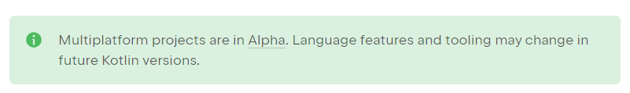

И соответственно в процессе работы мы выявили для себя такие очевидные и не очень плюсы:

- Один код одна модель - мы больше не имеем проблем что одна команда ждет другую, чтобы реализовать то-же самое, что
  существенно уменьшает количество затрат на разработку и соответственно повышает скорость доведения хотелок бизнеса до
  конечного потребителя.
- Одна команда - вынесение логики в одну SDK позволило выделить команду разработки которая занимается его развитием, и
  соответственно имея одну общую доменную модель разработчики аналитики и продуктовые менеджеры лучше понимают друг
  друга. И немало важный bus factor, который будет значительно ниже для 3-х разработчиков разрабатывающих один проект
  на одном языке, чем 3-х разработчика на 3-х проектах на 3-х языках.
- Статическая типизация - очень актуально для JS, конечно есть TypeScript, но учитывая что типизация просто работает из
  коробки однозначно записываем это в плюс.
- Тестирование - учитывая что когда вы пишете просто код без возможности посмотреть результат без компиляции вы рано или
  поздно начнете писать тесты. Как минимум потому что это написав тест вы сможете быстро проверять корректность вашего
  кода,
  и при этом этот тест останется что в свою очередь будет поднимать покрытие функционала тестами и повышать надежность
  кода. Так же написав тест вы покрываете сразу все ваши целевые платформы, что так же экономит ресурс отдела
  тестирования.
- Язык - кто бы что нее говорил, но лично для меня Kotlin лучший язык для разработки, изучая который возникает
  ощущение что язык писался людьми для людей. И это очень важно когда вы имеете сложную бизнес логику и вам важно
  написать понятный код, чтобы открывая метод или класс эта самая бизнес логика могла читаться, а не как в каком нибудь
  условном (без обид) Go открываешь метод, видишь кучу примитивных операций, но не можешь без скролла понять что они
  должны делать в совокупности.
  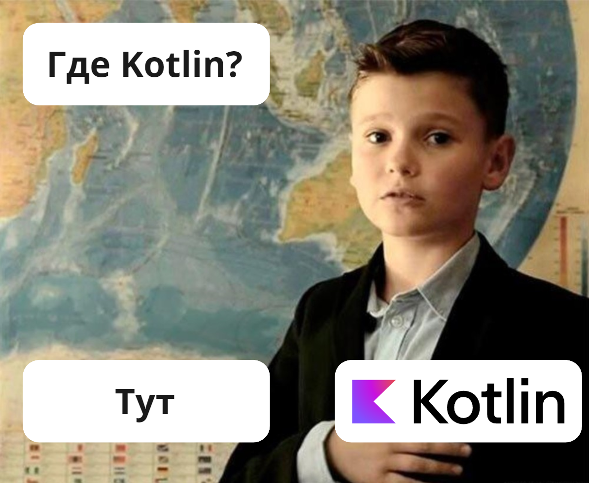

Но к сожалению у такого подхода имеются и минусы, такие как:

- Потеря производительности - это больше актуально для JS платформы, так как при компиляции создается не всегда
  идеальный код который создает некоторый overhead, но потери не такие значительные, чтобы отказываться от этого.
- Экспертиза разработчиков - хоть и разработчики будут писать на одном языке, но иногда возможно придется разбираться с
  задачами на стыке нескольких платформ, соответственно для хорошей команды необходимо помимо Kotlin желательно знать
  средства разработки платформ под которые они компилируют.
- Ограничения - учитывая что вы пишите общий код, этот код должен работать везде и работать одинаково, а значит то что
  может одна платформа, но не может другая будет недоступно, например на JS нельзя приостановить поток и подождать
  ответа сетевого запроса, а значит механизм приостановки потока будет доступен только специфичных платформах, но в
  общем коде нет. Под специфичными платформами я имею в виду то что вы можете использовать некоторые особенности
  платформы с
  помощью [ожидаемого и фактического объявления](https://kotlinlang.org/docs/multiplatform-connect-to-apis.html) при
  необходимости.

Думаю на этом этапе общее описание технологии дано. И теперь вы можете понять стоит ли читать статью дальше, добавить в
закладки,
чтобы вернуться позже, или может быть вам не интересно как это выглядит это на практики и не стоит на это тратить время.

## Практика

Далее я постараюсь продемонстрировать как на практике можно применить эту технологию. Для этого я написал ядро игры
крестики-нолики и реализовал отображение на трех языках JS (браузер), Swift (iOS), Java (android). Весь изложенный код
будет доступен в Git Hub репозитории по [ссылке](https://github.com/Tihon-Ustinov/tictactoe).

### Создание проекта

#### Окружение

Для начала работы с Kotlin Multiplatform желательно проверить все необходимое окружение с помощью
утилиты [KDoctor](https://github.com/Kotlin/kdoctor). После того как проверили и все есть можно смело начинать делать
проект. Для корректно работы результат проверки должен быть приблизительно таким.

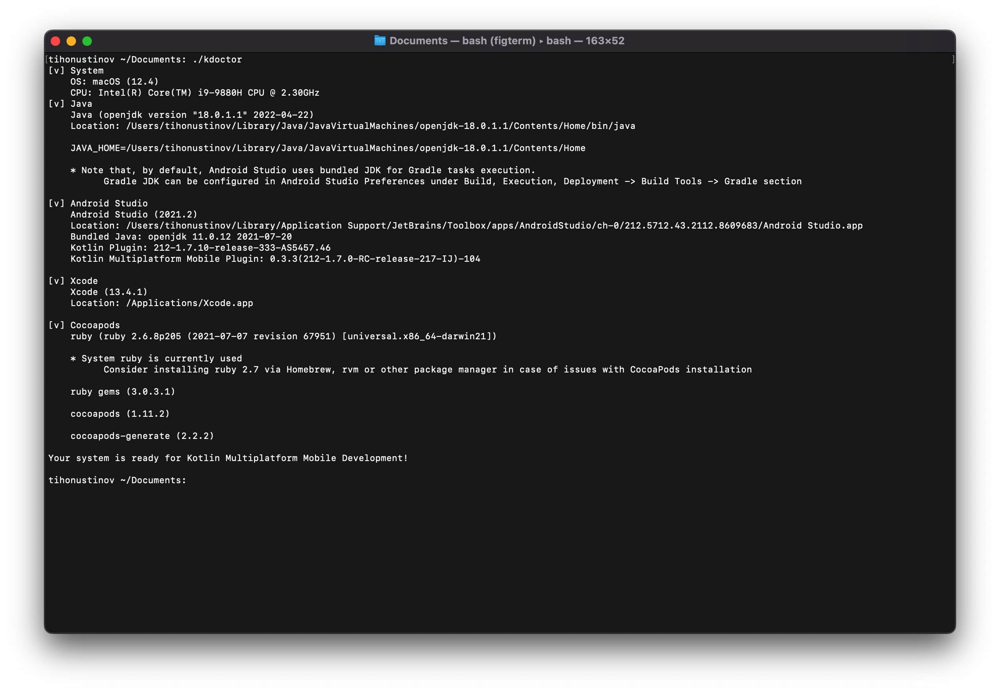

Вы можете использовать любое удобное для вас окружение, но помните что, чтобы разрабатывать под iOS с использованием
Kotlin Multiplatform нужен Command Line Tools (обычно ставится при установке xcode), и по политики Apple данный набор
инструментов можно установить только на продукцию Apple. Ну или может быть на Hackintosh тоже получится, честно говоря,
я не пробовал.

Скачать Command Line Tools можно
с [официального сайта Apple для разработчиков](https://developer.apple.com/download/all/).

#### Создание проекта

Далее для создания проекта можно
воспользоваться [Kotlin Multiplatform Wizard](https://terrakok.github.io/kmp-web-wizard/). Там выбираем вот такие
параметры:

- Выбираем текущую стабильную версию Kotlin.
- Для целевых сборок выбираем **JVM**, **JS**, **iOS** (при желании остальные можно будет добавить позже)
- Тесты включаем - в данной статье я нее буду писать тесты, так как проект является просто демонстрацией работы
  технологии, но если вы создаете реальный проект по этой статье то тесты вам точно пригодятся.

  Должна получиться приблизительно такая конфигурация.

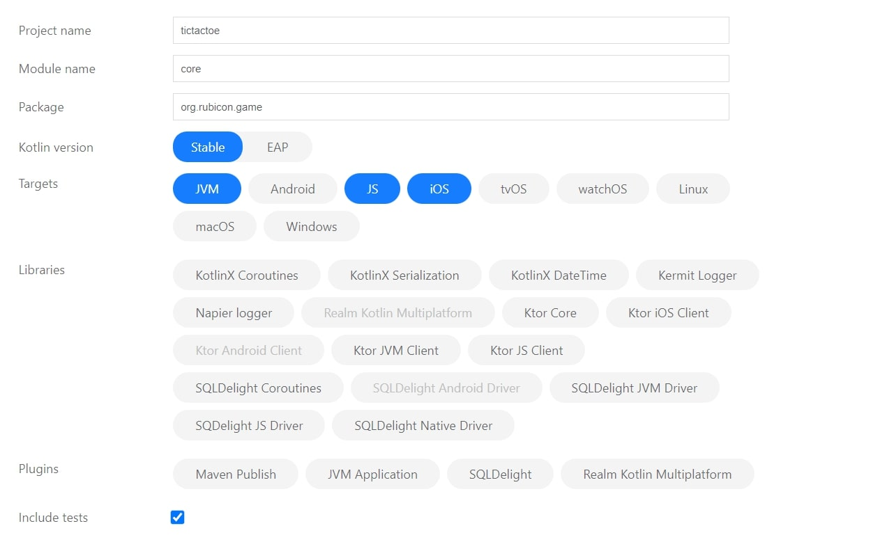

Далее скачиваем и разархивируем в вашу рабочую область. И открываем в вашей любимой IDE, но лучше использовать IntelliJ
IDEA, так как в ней есть некоторые вспомогательные функции для работы с Kotlin Multiplatform, например при
реализации [ожидаемого и фактического объявления](https://kotlinlang.org/docs/multiplatform-connect-to-apis.html)
классов IntelliJ IDEA поможет сгенерировать эти классы.

Kotlin Multiplatform Wizard по умолчанию сразу создает файлы с примерами классов и тестов: Platform.kt, CommonTest,
PlatformTest. Нам они не понадобятся поэтому эти файлы сразу удалим. И по итогу должна получиться вот такая структура
проекта.

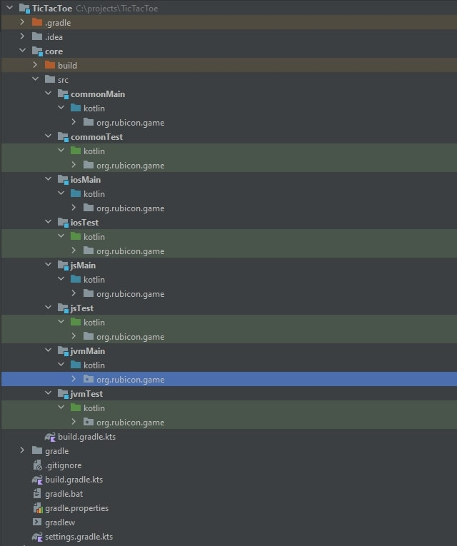

#### Настройка сборки

Далее для корректной компиляции под выбранные нами платформы необходимо настроить параметры сборки gradle. Для этого
немножко изменим три файла.

В первом файле *./settings.gradle.kts* явно укажем версию kotlin multiplatform.


<details>
  <summary>Код *./settings.gradle.kts*</summary>

```kotlin
pluginManagement {
    repositories {
        google()
        gradlePluginPortal()
        mavenCentral()
    }
    // Укажем явно так как в боле ранних версиях есть была ошибка при создании *d.ts компилятором IR
    plugins {
        kotlin("multiplatform") version "1.7.10"
    }
}

rootProject.name = "tictactoe"
include(":core")
```

</details>


Во втором укажем версию и группу, для того чтобы при после компиляции у нас были нормальные названия и версии
соответственно.

*./gradle.properties*

```properties
# Добавляем группу и версию остальное оставляем без изменений
group=ru.tikhon.tictactoe
version=1.0.0
# Остальное можно оставить так как есть
#Gradle
org.gradle.jvmargs=-Xmx2048M -Dkotlin.daemon.jvm.options\="-Xmx2048M"
#Kotlin
kotlin.code.style=official
#MPP
kotlin.mpp.enableCInteropCommonization=true
```

B в третьем файле *./core/build.gradle.kts* настроим параметры сборки под для конкретных платформ.

Где для jvm указываем версию java с которой должна быть совместим полученный на выходе *.jar файл. Можно поставить и
выше, это зависит от того где вы собираетесь подключать этот *.jar.

Для js ставим тип компилятора IR, IR потому что он после компиляции создает *.d.ts который необходим для поддержки
типизации TypeScript, а так же для того, чтобы ide проиндексировала его и при написании кода вы могли импортировать
классы автоматически средствами ide.

И укажем название фреймворка для iOS сборок.

Остальное оставляем без изменений.

*./core/build.gradle.kts*

```kotlin
plugins {
    kotlin("multiplatform")
}

kotlin {
    /* JVM Target Configuration */
    jvm {
        compilations.all {
            kotlinOptions.jvmTarget = "1.8"
        }
        withJava()
    }
    /* JS Target Configuration */
    js(IR) {
        binaries.executable()
        browser()
    }
    /* iOS Target Configuration */
    iosX64 {
        binaries {
            framework {
                baseName = "GAMEFramework"
            }
        }
    }
    iosArm64 {
        binaries {
            framework {
                baseName = "GAMEFramework"
            }
        }
    }
    iosSimulatorArm64 {
        binaries {
            framework {
                baseName = "GAMEFramework"
            }
        }
    }

    sourceSets {
        /* Main source sets */
        val commonMain by getting
        val jvmMain by getting
        val jsMain by getting
        val iosMain by creating
        val iosX64Main by getting
        val iosArm64Main by getting
        val iosSimulatorArm64Main by getting

        /* Main hierarchy */
        jvmMain.dependsOn(commonMain)
        jsMain.dependsOn(commonMain)
        iosMain.dependsOn(commonMain)
        iosX64Main.dependsOn(iosMain)
        iosArm64Main.dependsOn(iosMain)
        iosSimulatorArm64Main.dependsOn(iosMain)

        /* Test source sets */
        val commonTest by getting {
            dependencies {
                implementation(kotlin("test"))
            }
        }
        val jvmTest by getting
        val jsTest by getting
        val iosTest by creating
        val iosX64Test by getting
        val iosArm64Test by getting
        val iosSimulatorArm64Test by getting

        /* Test hierarchy */
        jvmTest.dependsOn(commonTest)
        jsTest.dependsOn(commonTest)
        iosTest.dependsOn(commonTest)
        iosX64Test.dependsOn(iosTest)
        iosArm64Test.dependsOn(iosTest)
        iosSimulatorArm64Test.dependsOn(iosTest)
    }
}
```

### Написание кода

Далее если вас не интересует разработка ядра игры, то вы можете написать простой класс с выводом сообщения по пути *
core/src/commonMain/kotlin/org/rubicon/game/SayHello.kt* с таким содержанием.

```kotlin
package org.rubicon.game

import kotlin.js.JsExport

@JsExport
class SayHello {
    fun say() {
        println("Hello from Kotlin Multiplatform")
    }
}
```

И перейти непосредственно к пункту "Реализация использования SDK на платформах" где описано как скомпилировать код и
добавить полученный в результате компиляции артефакт в нативные проекты платформ который мы ранее выбрали.

Либо вы можете рассмотреть пример реализации игры и познакомиться с примерами взаимодействия SDK с платформами и
некоторыми особенностями написания общего кода.

#### Проектирование

Для работы мультиплатформенности наш код должен удовлетворять следующим характеристикам:

- Должен быть полный набор классов необходимый для реализации игры
- Этот набор классов не должен зависеть от какой-либо платформы

Логика работы должна быть приблизительно такая:

1) Пользователь кликает кнопку играть
2) View создает экземпляр игры
3) Подписывается на изменения игры
4) Запускает игру
5) Обновляет представление
6) И начинается игра

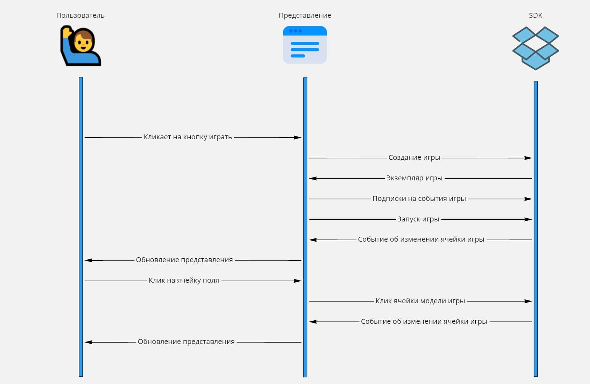

### Код

#### Реализация SDK

После того как готово к написанию кода можно приступать. В основном код будет писаться в **commonMain** и там
будут располагаться классы которые потом будут использоваться уже на платформах где будет запускаться наша игра.

Дальше будет много кода, я не хотел весь его дублировать в статью и думал сделать проект чтобы было еще меньше кода, но
проект с условным hello world не показал бы кейса реального использования. Поэтому кто не хочет листать портянку лучше
проследуйте на github проект [tictactoe](https://github.com/Tihon-Ustinov/tictactoe).

По задуманной логике обновление представление должно происходить по событию, а это значит нужно создать класс который
будет уметь принимать слушателей и уметь кидать события, назовем такой класс **EventEmitter** а его интерфейс **
IEventEmitter**.

Но события в нашей модели должны нести некоторую информацию, например если view подпишется на изменение
состояния поля, при срабатывании подписки одно должно знать где именно был поставлен крестик или нолик. Поэтому сначала
объявим **IEvent** и реализуем его имплементацию **Event**.

interface *core/src/commonMain/kotlin/org/rubicon/game/IEvent.kt*

```kotlin
package org.rubicon.game

import kotlin.js.JsExport

/**
 * Событие, которое получит пользователь при срабатывании подписки
 * @property type Тип события
 * @property source Источник события
 */
@JsExport
interface IEvent<T : Enum<T>, S> {
    val type: T
    val source: S

    /**
     * Данный метод при деструктуризации вернет тип события
     * */
    operator fun component1(): T = this.type

    /**
     * Данный метод при деструктуризации вернет источник события
     * */
    operator fun component2(): S = this.source
}
```

В данном листинге кода мы можем наблюдать аннотацию **@JsExport**, она необходима чтобы сущность для которой указывается
эта аннотация была доступна на JS и чтобы названия методов сохранились. Так же наиболее часто можно встретить
аннотацию **@JsName**, которая необходима для указания наименования в случаях когда это не может сделаться
автоматически, например в JS нет перегрузки поэтому для перегружаемых методов нужно давать разные названия. Так же
нередко можно заметить аннотацию **@JvmOverloads** которая позволяет реализовать аргументы по умолчанию посредством
перегрузки в Java. Ну и так же в приведенных ниже листингах кода можно встретить аннотацию **@Throws** добавляет в
целевую сборку о том что метод может быть завершен с ошибкой и стоит обработать исключение.

class *core/src/commonMain/kotlin/org/rubicon/game/impl/events/Event.kt*

```kotlin
package org.rubicon.game.impl.events

import org.rubicon.game.IEvent
import kotlin.js.JsExport

@JsExport
open class Event<T : Enum<T>, S>(
    override val type: T,
    override val source: S
) : IEvent<T, S>
```

После реализации события можем перейти к объявлению **IEventEmitter** и его реализации **EventEmitter**.

Для более стандартизированной работы с данными объявим у **IEventEmitter** два обобщенных типа:

- T - это тип события, который может быть только перечисляемым типом.
- S - это источник события.

Interface *./core/src/commonMain/kotlin/org/rubicon/game/IEventEmitter.kt*

```kotlin
package org.rubicon.game

import kotlin.js.JsExport


@JsExport
class DuplicateListenersException(override val message: String) : Throwable(message)

/**
 * Тип подписки
 * данная функция обратного вызова должна принимать на вход событие
 * с которым она и будет работать
 * */
typealias EventCallBack<T, S> = (IEvent<T, S>) -> Unit

/**
 * Создает возможность подписываться на события объекта
 * */
@JsExport
interface IEventEmitter<T : Enum<T>, S> {
    /**
     * Создать подписку
     * */
    @Throws(DuplicateListenersException::class)
    fun on(eventType: T, callBack: EventCallBack<T, S>)

    /**
     * Удалить подписку
     * */
    fun del(eventType: T, callBack: EventCallBack<T, S>)

    /**
     * Создать подписку, которая будет удалена после срабатывания события
     * */
    fun once(eventType: T, callBack: EventCallBack<T, S>)
}
```

class *core/src/commonMain/kotlin/org/rubicon/game/impl/events/EventEmitter.kt*

```kotlin
package org.rubicon.game.impl.events

import org.rubicon.game.DuplicateListenersException
import org.rubicon.game.EventCallBack
import org.rubicon.game.IEvent
import org.rubicon.game.IEventEmitter
import kotlin.js.JsExport

@JsExport
abstract class EventEmitter<T : Enum<T>, S> : IEventEmitter<T, S> {
    private val listeners: LinkedHashMap<T, ArrayList<EventCallBack<T, S>>> = linkedMapOf()

    override fun on(eventType: T, callBack: EventCallBack<T, S>) {
        val eventTypeCollection = listeners.getOrPut(eventType) {
            arrayListOf()
        }
        if (callBack in eventTypeCollection) {
            throw DuplicateListenersException("Данная подписка уже существует.")
        }
        eventTypeCollection.add(callBack)
    }

    override fun del(eventType: T, callBack: EventCallBack<T, S>) {
        listeners[eventType]?.remove(callBack)
    }

    override fun once(eventType: T, callBack: EventCallBack<T, S>) {
        this.on(eventType) {
            this.del(eventType, callBack)
            callBack(it)
        }
    }

    protected fun emit(event: IEvent<T, S>) {
        listeners[event.type]?.forEach {
            it(event)
        }
    }
}
```

Теперь простым наследованием мы можем научить любой класс кидать события, что позволяет нам перейти к созданию главного
класса игры **Game**. Но для этого так же нужно объявить типы каких событий наш класс **Game** будет кидать.

Соответственно события которые могут возникнуть во время игры

- GAME_OVER - окончание игры, будет кидаться когда какая-то сторона выиграла или все доступные ходы закончились.
- CHANGE_CELL - событие изменения состояния ячейки игрового поля (того кубика, где рисуется крестик или нолик),
  соответственно будет кидаться когда в ячейку проставится крестик, нолик или сбросится состояние.

enum *core/src/commonMain/kotlin/org/rubicon/game/impl/events/GameEventType.kt*

```kotlin
package org.rubicon.game.impl.events

import kotlin.js.JsExport

/**
 * События, которые могут случиться во время игры
 * */
@JsExport
enum class GameEventType {
    /**
     * Игра окончена
     * */
    GAME_OVER,

    /**
     * Изменилось состояние поля
     * */
    CHANGE_CELL
}
```

Теперь у нас достаточный набор классов и интерфейсов чтобы, чтобы объявить интерфейс **IGame** и указать методы которые
можно будет вызывать на стороне представления.

interface *core/src/commonMain/kotlin/org/rubicon/game/IGame.kt*

```kotlin
package org.rubicon.game

import org.rubicon.game.impl.events.GameEventType
import kotlin.js.JsExport

/**
 * Игра
 * Реализует главную логику игры кидает события по окончанию игры или при изменении состояния игрового поля
 * */
@JsExport
interface IGame : IEventEmitter<GameEventType, IGame> {
    /**
     * Запускает игру
     *
     * Кидает события об изменении каждой игровой ячейки для отрисовки поля
     * */
    fun play()

    /**
     * Сбрасывает состояние игры
     * */
    fun reset()
}
```

Но для непосредственной реализации самой имплементации **IGame** нам не хватает еще четырех сущностей:

Сущность первая. **PlayerType** перечисляемый класс обозначающий игрока, крестик, нолик или его отсутствие.

enum *core/src/commonMain/kotlin/org/rubicon/game/impl/PlayerType.kt*

```kotlin
package org.rubicon.game.impl

import kotlin.js.JsExport

/**
 * Тип игрока
 * */
@JsExport
enum class PlayerType {
    /**
     * Игрок отсутствует
     * */
    NONE,

    /**
     * Игрок, который играет крестиками
     * */
    CROSS,

    /**
     * Игрок, который играет ноликами
     * */
    ZERO
}
```

Сущность вторая. **IFieldCell** ячейка игрового поля, которая будет отвечать за квадратик с крестиком или ноликом на
игровом поле. Экземпляр реализации этого класса будет отдаваться представлению для отрисовки его состояния и для
принятия клика.

interface *core/src/commonMain/kotlin/org/rubicon/game/IFieldCell.kt*

```kotlin
package org.rubicon.game

import org.rubicon.game.impl.PlayerType
import kotlin.js.JsExport

/**
 * Элемент игрового где должны отображаться крестики и нолики
 * */
@JsExport
interface IFieldCell {
    /**
     * При клике меняется состояние кнопки на состояние активного игрока
     * */
    fun click()

    /**
     * Возвращает значение каким игроком было нажато
     * */
    fun getState(): PlayerType

    /**
     * Возвращает координату по оси X
     * */
    fun getX(): Int

    /**
     * Возвращает координату по оси Y
     * */
    fun getY(): Int
}
```

И конечно же реализуем имплементацию **FieldCell**.

class *core/src/commonMain/kotlin/org/rubicon/game/impl/FieldCell.kt*

```kotlin
package org.rubicon.game.impl

import org.rubicon.game.IFieldCell
import org.rubicon.game.impl.events.Event
import org.rubicon.game.impl.events.EventEmitter
import kotlin.js.JsExport

@JsExport
enum class FieldCellEvents {
    CLICK
}

@JsExport
class FieldCell(
    private val x: Int,
    private val y: Int,
    private var state: PlayerType = PlayerType.NONE
) : EventEmitter<FieldCellEvents, FieldCell>(), IFieldCell {

    /**
     * Во время игры состояние может быть изменено либо сброшено
     * */
    internal fun changeState(state: PlayerType) {
        this.state = state
    }

    override fun click() {
        // Мы кинем событие, что пользователь кликнул только если уже не кликнуто раньше
        if (this.state == PlayerType.NONE) {
            this.emit(Event(FieldCellEvents.CLICK, this))
        }
    }

    override fun getState(): PlayerType = this.state

    override fun getX(): Int = this.x
    override fun getY(): Int = this.y
}
```

Сущность третья. **GameCellEvent** событие обозначающее изменения состояния ячейки игрового поля с указанием этой самой
ячейки.

class *core/src/commonMain/kotlin/org/rubicon/game/impl/events/GameCellEvent.kt*

```kotlin
package org.rubicon.game.impl.events

import org.rubicon.game.IGame
import org.rubicon.game.impl.FieldCell
import kotlin.js.JsExport

@JsExport
class GameCellEvent(
    source: IGame,
    // Ячейка игрового поля
    val fieldCell: FieldCell
) : Event<GameEventType, IGame>(GameEventType.CHANGE_CELL, source)
```

Сущность четвертая. **GameOverEvent** событие обозначающее окончание игры с содержанием информации о победителе и
выигрышной комбинации игровых ячеек.

class *core/src/commonMain/kotlin/org/rubicon/game/impl/events/GameOverEvent.kt*

```kotlin
package org.rubicon.game.impl.events

import org.rubicon.game.IGame
import org.rubicon.game.impl.FieldCell
import org.rubicon.game.impl.PlayerType
import kotlin.js.JsExport

@JsExport
class GameOverEvent(
    game: IGame,
    winLine: List<FieldCell>? = null
) : Event<GameEventType, IGame>(GameEventType.GAME_OVER, game) {
    // Приводим к Array для того чтобы в JS этот метод вернул нативный массив
    val winLine = winLine?.toTypedArray()

    // Так как выигрышная конфигурация может быть только одной стороны мы можем получить победителя оттуда
    val winner: PlayerType = winLine?.first()?.getState() ?: PlayerType.NONE
}
```

И последний самый интересный класс в нашем SDK, но не последний в этой статье, класс **Game**. Этот класс реализует
основную логику игры. Суть логики должна быть всем понятна кто играл в крестики-нолики. Изначально у нас есть поле 3 x
3, и выигрывает сторона, которая поставит свой знак в 3-х клетках подряд. Логика работы такая что мы

- создаем поле из ячеек
- подписываемся на событие клика этих ячеек
- при событии клика ставим им значение кто кликнул с попутным уведомлением об этом
- проверяем законченность игры
- кидаем событие об окончании игры

class *core/src/commonMain/kotlin/org/rubicon/game/impl/Game.kt*

```kotlin
package org.rubicon.game.impl

import org.rubicon.game.IEvent
import org.rubicon.game.IGame
import org.rubicon.game.impl.events.EventEmitter
import org.rubicon.game.impl.events.GameCellEvent
import org.rubicon.game.impl.events.GameEventType
import org.rubicon.game.impl.events.GameOverEvent
import kotlin.js.JsExport

@JsExport
class Game : EventEmitter<GameEventType, IGame>(), IGame {
    // Сразу инициализируем поле 3 x 3 и подписываемся на событие клика
    private val field: List<List<FieldCell>> = List(3) { y ->
        List(3) { x ->
            FieldCell(x, y).also {
                it.on(FieldCellEvents.CLICK, this::onClickFieldCell)
            }
        }
    }

    // Содержит информацию о том кто в данный момент времени ходит
    private var currentPlayer: PlayerType = PlayerType.CROSS

    // Все возможные выигрышные позиции
    private val winConditions: List<List<FieldCell>> by lazy {
        this.getAllWinConditions()
    }

    /**
     * Обработчик события клика по ICell
     *
     * Проставляет ячейки кликнувшего игрока, переключает ход игрока и проверяет завершенность игры
     *
     * */
    private fun onClickFieldCell(event: IEvent<FieldCellEvents, FieldCell>) {
        if (this.currentPlayer != PlayerType.NONE) {
            val fieldCell: FieldCell = event.source
            this.changeFiledCellState(fieldCell, currentPlayer)
            this.turnMove()
            this.checkGameOver()
        }
    }

    /**
     * Меняет состояние ячейки и сообщает об этом событием
     * */
    private fun changeFiledCellState(fieldCell: FieldCell, state: PlayerType) {
        fieldCell.changeState(state)
        this.emit(GameCellEvent(this, fieldCell))
    }

    /**
     * Переключает текущего игрока на его противника или на сторону по умолчанию
     * */
    private fun turnMove() {
        this.currentPlayer = when (currentPlayer) {
            PlayerType.CROSS -> PlayerType.ZERO
            PlayerType.ZERO,
            PlayerType.NONE -> PlayerType.CROSS
        }
    }

    /**
     * Проверяет статус окончания игры
     * */
    private fun checkGameOver() {
        val winLine = this.winConditions.find { this.isMatchLine(it) }
        val event = when {
            winLine != null -> GameOverEvent(this, winLine)
            !hasFreeCells() -> GameOverEvent(this)
            else -> null
        }
        if (event != null) {
            this.currentPlayer = PlayerType.NONE
            this.emit(event)
        }
    }

    /**
     * Проверяет наличие ячеек на которые еще не кликали
     * */
    private fun hasFreeCells(): Boolean {
        return this.field.any { row ->
            row.any { it.getState() == PlayerType.NONE }
        }
    }

    /**
     * Проверяет что переданная комбинация ячеек выбрана одним игроком
     * */
    private fun isMatchLine(row: List<FieldCell>): Boolean {
        if (row.isEmpty()) return false
        val firstState = row.first().getState()
        if (firstState == PlayerType.NONE) return false
        return row.all { it.getState() == firstState }
    }

    /**
     * Возвращает все возможные выигрышные комбинации
     * */
    private fun getAllWinConditions(): List<List<FieldCell>> {
        val result: ArrayList<List<FieldCell>> = arrayListOf()
        val diagonal: ArrayList<FieldCell> = arrayListOf()
        val diagonalOpposite: ArrayList<FieldCell> = arrayListOf()
        for (i in 0..2) {
            // Добавляем все строчки
            result.add(
                listOf(
                    this.field[i][0],
                    this.field[i][1],
                    this.field[i][2],
                )
            )
            // Добавляем все колонки
            result.add(
                listOf(
                    this.field[0][i],
                    this.field[1][i],
                    this.field[2][i],
                )
            )
            // Добавляем варианты по диагоняли
            diagonal.add(this.field[i][i])
            diagonalOpposite.add(this.field[2 - i][i])
        }
        result.add(diagonal)
        result.add(diagonalOpposite)
        return result
    }

    /**
     * Сбрасывает игру чтобы представление получило обновление состояний и отрисовало поле
     * */
    override fun play() {
        // Суть метода заключается в том чтобы отрисовать ячейки игрового поля
        // Поэтому reset сюда подходит
        this.reset()
    }

    /**
     * Сбрасывает состояние ячеек на состояние ни кем не выбрано
     * */
    override fun reset() {
        this.currentPlayer = PlayerType.CROSS
        for (y in 0 until this.field.size) {
            for (x in 0 until this.field[y].size) {
                this.changeFiledCellState(this.field[y][x], PlayerType.NONE)
            }
        }
    }

}
```

Все, SDK готово, а это значит можем начинать использовать его на всех платформах в которые может компилироваться Kotlin,
и начнем с JS.

### Реализация использования SDK на платформах

#### Реализация на JS

Для того чтобы получить итоговую сборку под платформу JS нужно выполнить команду gradle **jsBrowserProductionWebpack**.

```bash
./gradlew jsBrowserProductionWebpack
```

После чего у вас должен появиться js файл с названием модуля *core/build/distributions/core.js*.

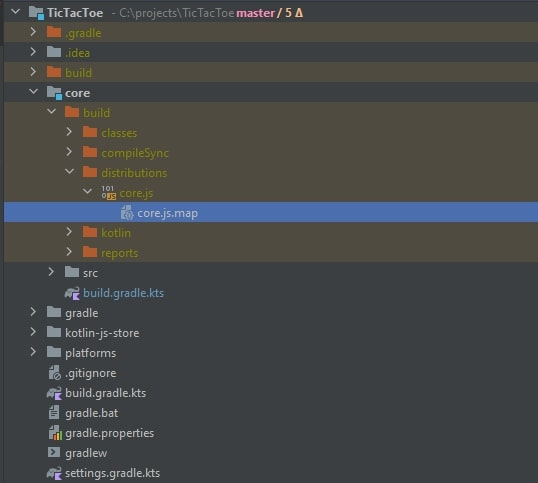

Или если вы хотите получить профит от типизации то тогда нужно брать директорию по пути *
build/js/packages/tictactoe-core* которая по своей структуре является обычным npm пакетом c исходным кодом на JS,
файлом *package.json* и *.d.ts файлом внутри.

Обе сборки будут содержать все написанные нами ранее классы только на js. И соответственно мы можем добавить один из
этих артефактов в любой js проект. Что мы сейчас и сделаем.

Проект на js будет максимально простой, одна единственная **index.html** страница, к которой подключается собранный
ранее SDK посредством добавления html тега *script*. В этот же файле реализованы не сложные стили игрового поля, и
процесс взаимодействия с SDK. Уверен, что можно было бы реализовать это красивее и чище, но это лишь демонстрация
возможности работы с SDK а на паттерн проектирования.

*index.js*

```html
<!DOCTYPE html>
<head>
    <meta charset="UTF-8">
    <title>Tic Tac Toe</title>
    <!--  Подключаем скомпилированный нами ранее SDK  -->
    <script src="../../core/build/distributions/core.js"></script>
    <!--  Описываем стили поля и ячеек игрового поля  -->
    <style>
        .field {
            display: flex;
            flex-wrap: wrap;
            align-content: flex-start;
            width: 900px;
            height: 900px;
            background-color: #e6e6e6;
            border-radius: 10px;
            padding: 10px 0 0 10px;

        }

        .field-cell {
            color: black;
            width: 290px;
            height: 290px;
            background-color: #a7c6c6;
            margin: 0 10px 10px 0;
            border-radius: 10px;
            cursor: pointer;
        }

        #crossIcon, #circleIcon {
            display: none;
        }
    </style>
</head>
<!-- Сюда будем выводить результат с кнопкой перезапуска -->
<div id="result"></div>
<!-- Главное поле сюда при рендере закинем ячейки поля -->
<div class="field" id="field"></div>
<!-- Сохраним иконки X и O в HTML представлении -->
<div id="crossIcon">
    <svg class="svg-icon"
         style="width: 100%; height: auto;vertical-align: middle;fill: currentColor;overflow: hidden;"
         viewBox="0 0 1024 1024" version="1.1" xmlns="http://www.w3.org/2000/svg">
        <path d="M810.65984 170.65984q18.3296 0 30.49472 12.16512t12.16512 30.49472q0 18.00192-12.32896 30.33088l-268.67712 268.32896 268.67712 268.32896q12.32896 12.32896 12.32896 30.33088 0 18.3296-12.16512 30.49472t-30.49472 12.16512q-18.00192 0-30.33088-12.32896l-268.32896-268.67712-268.32896 268.67712q-12.32896 12.32896-30.33088 12.32896-18.3296 0-30.49472-12.16512t-12.16512-30.49472q0-18.00192 12.32896-30.33088l268.67712-268.32896-268.67712-268.32896q-12.32896-12.32896-12.32896-30.33088 0-18.3296 12.16512-30.49472t30.49472-12.16512q18.00192 0 30.33088 12.32896l268.32896 268.67712 268.32896-268.67712q12.32896-12.32896 30.33088-12.32896z"/>
    </svg>
</div>
<div id="circleIcon">
    <svg class="svg-icon"
         style="width: 100%; height: auto;vertical-align: middle;fill: currentColor;overflow: hidden;"
         viewBox="0 0 1024 1024" version="1.1" xmlns="http://www.w3.org/2000/svg">
        <path d="M512 85.333333a426.666667 426.666667 0 1 0 426.666667 426.666667A426.666667 426.666667 0 0 0 512 85.333333z m0 768a341.333333 341.333333 0 1 1 341.333333-341.333333 341.333333 341.333333 0 0 1-341.333333 341.333333z"/>
    </svg>
</div>

<body>
<script>
    /**
     * Обращаемся к SDK и импортируем то что будем использовать для создания игры
     * */
    const sdk = window.core.org.rubicon.game.impl
    const {Game, PlayerType} = sdk
    const {GameEventType} = sdk.events

    // Иконки крестиков и ноликов которые будем выводить в ячейки
    const crossSVG = document.getElementById("crossIcon").innerHTML;
    const circleSymbol = document.getElementById("circleIcon").innerHTML;

    // Сюда будем сохранять HTML кнопки
    // чтобы при событии изменения состояния мы быстро нашли нашу кнопку
    // и обновили представление
    const buttonMap = new Map()

    /**
     * Обработчик события окончания игры
     *
     * Выводит результат на игры на страницу
     * */
    function gameOver(event) {
        // Достаем данные из события
        const {winner, source} = event
        const winnerText = document.createElement("H3")
        // На основании типа игрока делаем сообщение о том кто выиграл
        switch (winner) {
            case PlayerType.NONE:
                winnerText.innerText = "Ничья"
                break
            case PlayerType.CROSS:
                winnerText.innerText = "Выиграли крестики"
                break
            case PlayerType.ZERO:
                winnerText.innerText = "Выиграли нолики"
                break
        }
        // Создаем кнопку для запуска игры сначала
        const resultElement = document.getElementById("result")
        const repeatButton = document.createElement("button")
        repeatButton.innerText = "Играть еще раз"
        repeatButton.addEventListener("click", () => {
            source.reset()
            resultElement.innerHTML = ""
        })
        // Выводи результат и кнопку
        resultElement.appendChild(winnerText)
        resultElement.appendChild(repeatButton)
    }

    /**
     * Создает ячейку игрового поля создает подписку чтобы при клике по ui кнопке вызывался клик ячейки из SDK
     * */
    function createUICell(hash, fieldCell) {
        const htmlCell = document.createElement("div")
        htmlCell.classList.add("field-cell")
        htmlCell.addEventListener("mousedown", () => fieldCell.click())
        document.getElementById("field").appendChild(htmlCell)
        buttonMap.set(hash, htmlCell)
    }

    /**
     *  Обновляет состояние представления путем обработки изменения состояний ячеек
     * */
    function updateView(event) {
        // Получаем ячейку
        const {fieldCell} = event
        const cellHash = `${fieldCell.getY()}-${fieldCell.getX()}`
        if (!buttonMap.has(cellHash)) {
            // если ранее не обрабатывали данную ячейку создаем html кнопку для этой ячейки
            createUICell(cellHash, fieldCell)
        }
        // Обновляем состояние html кнопки
        const uiElement = buttonMap.get(cellHash)
        switch (fieldCell.getState()) {
            case PlayerType.NONE:
                uiElement.innerHTML = ""
                break
            case PlayerType.CROSS:
                uiElement.innerHTML = crossSVG
                break
            case PlayerType.ZERO:
                uiElement.innerHTML = circleSymbol
                break
        }
    }

    /**
     * Теперь просто создаем игру
     * */
    const game = new Game()
    /**
     * Подписываемся на события
     * */
    game.on(GameEventType.GAME_OVER, gameOver)
    game.on(GameEventType.CHANGE_CELL, updateView)
    /**
     * И запускаем
     * */
    game.play()
</script>
</body>
</html>
```

И вот так просто с точки зрения потребителя SDK мы интегрировали написанный на Kotlin код в JS пример и получили вот
такой работающий результат.


Теперь сделаем то же самое для приложения под iOS.

#### Реализация на Swift

Так же как и для js, прежде чем создавать приложение нужно скомпилировать наш Kotlin код в Framework с которым будет
дружить Xcode, для этого нужно выполнить вот такие команды.

```bash
./gradlew linkReleaseFrameworkIosArm64 linkReleaseFrameworkIosX64 &&
xcodebuild -create-xcframework \
    -framework ./core/build/bin/iosArm64/releaseFramework/GAMEFramework.framework \
    -framework ./core/build/bin/iosX64/releaseFramework/GAMEFramework.framework \
    -output ./core/build/bin/core.xcframework
```

Где `inkReleaseFrameworkIosArm64` и `linkReleaseFrameworkIosX64` команды компиляция кода под целевые архитектуры iOS,
а `xcodebuild` это склейка полученных от первой команды  *.framework в один *.xcframework который необходим нам для
подключения его к проекту, чтобы получить возможность использовать классы написанные на kotlin в swift приложении.

После того как получили *.xcframework можем перейти к реализации приложения на swift. Для этого создадим простое iOS
приложение в Xcode.

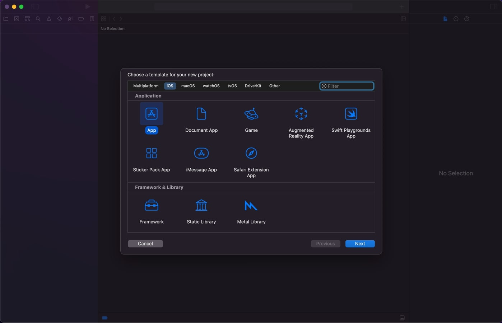

Соответственно указываем название приложение и наименование организации и выбираем интерфейс SwiftUI.

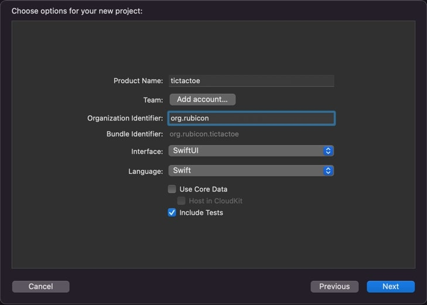

Теперь после создания проекта необходимо добавить наш созданный ранее framework в этот проект. Для этого нужно выполнить
следующие шаги.

1) Первый шаг кликаем на название проекта, чтобы перейти к его настройкам.
2) Далее кликаем **+** в пункте **Frameworks, Libraries and Embedded content**.
   В открывшемся окне нажимаем **Add other** и выбираем созданную ранее папку *./core/build/bin/core.xcframework*
3) Если все сделано правильно наш framework должен появиться в таблице

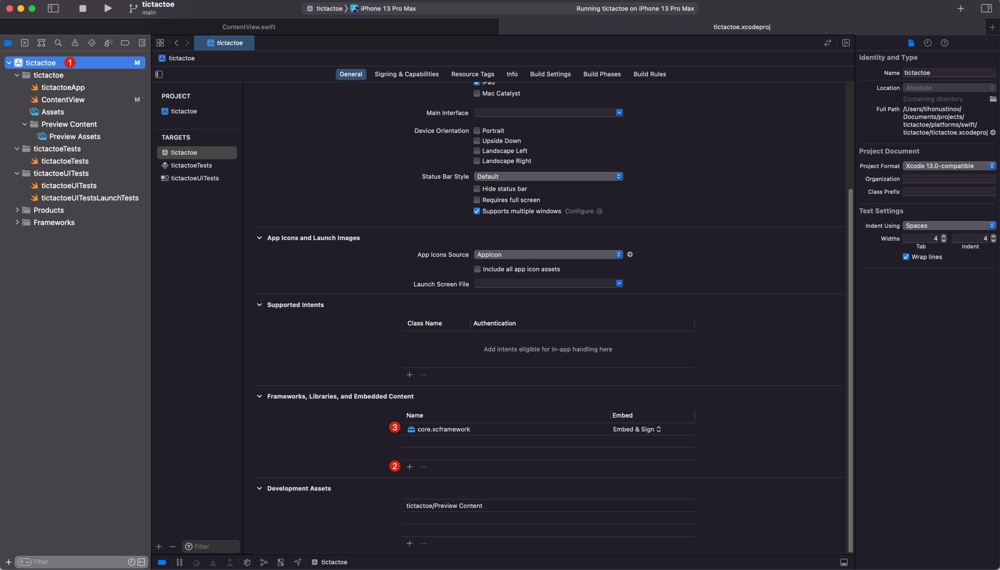

После того как framework был успешно добавлен, мы можем импортировать его в swift коде. Название для импорта должно
соответствовать baseName который мы указали в *./core/build.gradle.kts*. Далее осталось только написать код работы с SDK
и отображением интерфейса, чтобы получить полноценное приложение под iOS. Для этого переходим в файл **ContentView**
который автоматически создал Xcode при создании проекта. И напишем там вот такой вот код.

*ContentView.swift*

```swift
import SwiftUI
// Импортируем наш SDK который мы написали на Kotlin
import GAMEFramework

// Создаем класс для работы с SDK и чтобы View обновляла данные смотря на него
class GameUI : ObservableObject {
    // Переменные которые будут отображаться во view
    @Published var isGameOver: Bool = false
    @Published var isGameStarted: Bool = false
    @Published var winnerName: String = ""
    @Published var field: [[String]] = [
        [" ", " ", " "],
        [" ", " ", " "],
        [" ", " ", " "]
    ]
    // Игра
    private let game: Game = Game()
    // Ячейки поля
    private var gameCells: [String: FieldCell] = [:]

    // По нажатии кнопки играть вызывается этот метод
    func start () {
        do {
            // Подписываемся на события обновления ячеек и окончания игры
            try game.on(eventType: .changeCell, callBack: onChangeCell)
            try game.on(eventType: .gameOver, callBack: onGameOver)
        } catch {
            print("Ошибка")
        }
        // Запускаем процесс игры
        game.play()
        isGameStarted = true
    }
	
    // Перезапуск игры
    func playAgain() {
        isGameOver = false
        game.reset()
    }

    // view будет говорить какая кнопка была нажата,
    // а этот метод будут уже вызывать соответствующий метод у ячеки поля из SDK
    func clickButton(x: Int, y: Int) {
        if (isGameOver || !isGameStarted) {
            return
        }
        // Получаем FieldCell и вызываем у него click
        gameCells[makeHash(x: x, y: y)]?.click()
    }

    // Обработчик событий изменения состояние ячейки игрового поля
    private func onChangeCell(event: IEvent) {
        // Получаем ячеку из события
        let fieldCell = (event as! GameCellEvent).fieldCell
        // Создаем хеш и сохраняем в мапу для более удобного поиска в дальнейшем
        let hash = makeHash(x: Int(fieldCell.getX()), y: Int(fieldCell.getY()))
        if (!gameCells.keys.contains(hash)) {
            gameCells[hash] = fieldCell
        }
        // и обновляем состояние чтобы view обновлял ячейку которая изменилась
        field[Int(fieldCell.getY())][Int(fieldCell.getX())] = stateToString(state: fieldCell.getState())
    }

    // Обработчик окончания игры
    private func onGameOver(event: IEvent) {
        // Ставим значения окончания игры чтобы игрок больше не мог кликать кнопки
        isGameOver = true
        // И записываем выигравшую сторону
        switch ((event as! GameOverEvent).winner) {
        case .zero:
            winnerName = "O победили"
        case .cross:
            winnerName = "X победили"
        default:
            winnerName = "Ничья"
        }
    }

    // Преобразуем состояние ячеки в строку которая будет выводиться в кнопке
    private func stateToString(state: PlayerType) -> String {
        switch state {
        case .cross:
            return "X"
        case .zero:
            return "O"
        default:
            return " "
        }
    }

    private func makeHash(x: Int, y: Int) -> String {
        return String(x) + "-" + String(y)
    }
}

// Реализуем отображение
struct ContentView: View {
    @ObservedObject var gameUI = GameUI()
    var body: some View {
        VStack(alignment: .center) {
            // Блок ячеек игрового поля, выводим циклом в цикле поле 3 х 3
            ForEach((0...2), id: \.self) { y in
                HStack(spacing: 5) {
                    Group {
                        ForEach((0...2), id: \.self) { x  in
                            Button(action: { gameUI.clickButton(x: x, y: y) }) {
                                // Отрисовываем состояние соответсвующее ячейки
                                Text(gameUI.field[y][x])
                            }
                        }
                    }
                    // Устанавливаем свойства отображения которое будет применено для всех кнопок
                    .frame(maxWidth:.infinity)
                    .padding()
                    .foregroundColor(Color.black)
                    .font(.system(size: 64, weight: .bold, design: .default))
                    .background(Color(red: 0.654, green: 0.654, blue: 0.776))
                    .cornerRadius(5)
                }
            }.opacity(gameUI.isGameStarted ? 1 : 0)
            // Вывод результата игры с кнопкой перезапуска игры
            Group {
                Text(gameUI.winnerName)
                Button("again", action: gameUI.playAgain)
            }.opacity(gameUI.isGameOver ? 1 : 0)
            // Кнопка запуска игры
            Button("play", action: gameUI.start)
                .font(.system(size: 32, weight: .bold, design: .default))
                .opacity(gameUI.isGameStarted ? 0 : 1)
        }
    }
}

struct ContentView_Previews: PreviewProvider {
    static var previews: some View {
        ContentView()
    }
}
```

Конечно наверное не стоит пихать все в один файл и в идеале при реальной разработке нужно это все разделить в
соответствии с паттернами проектирования, но так как это демо проект можно и сделать так. В любом случае это работает и
после запуска мы можем наблюдать вот такой вот результата.

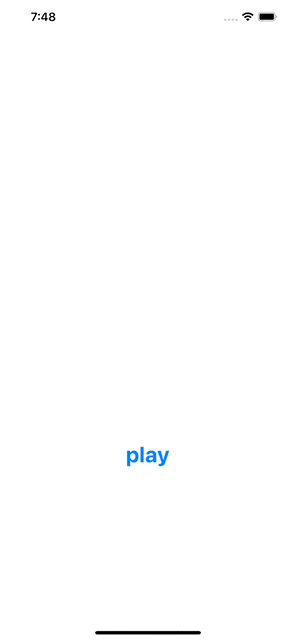

#### Реализация на Java

Мы уде реализовали не сложными махинациями реализации на js и swift, и сейчас реализуем последнюю в этой статье, но не
последнюю из возможных, реализацию. И речь пойдет о мобильном приложении под Android, и по-хорошему нужно использовать
Kotlin для разработки мобильных приложений под Android как [объявил Google](https://developer.android.com/kotlin/first)
в 2019 году, но мы напишем на Java, чтобы продемонстрировать работоспособность нашего SDK c java.

Несложно догадаться что для JVM проекта нам нужен *.jar файл который мы могли бы подключить в проект, и получить его
можно выполнив команду.

```bash
./gradlew jvmJar
```

После чего в папке *core/libs* будет файл**core-jvm-1.0.0.jar** который нужно будет в дальнейшем подключить в
приложение. В ваших проектах название конечного файла может отличаться, в зависимости от вашего проекта, но файл всегда
будет содержать приставку jvm.

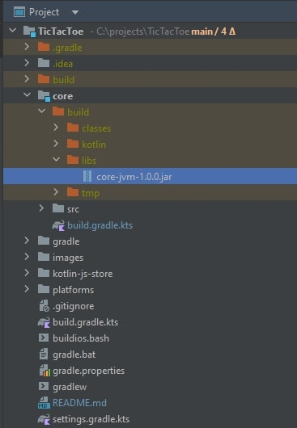

Делать приложение под Android будем конечно же будем в Android Studio. При создании нового проекта выбираем создать **
Empty Activity**.

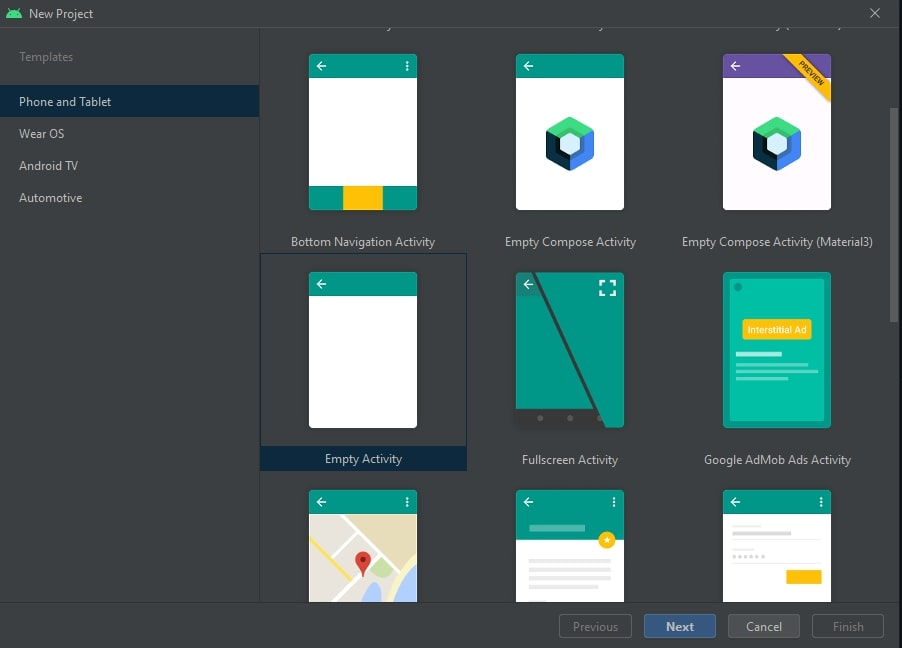

Заполняем все необходимые данные, и выбираем язык Java.

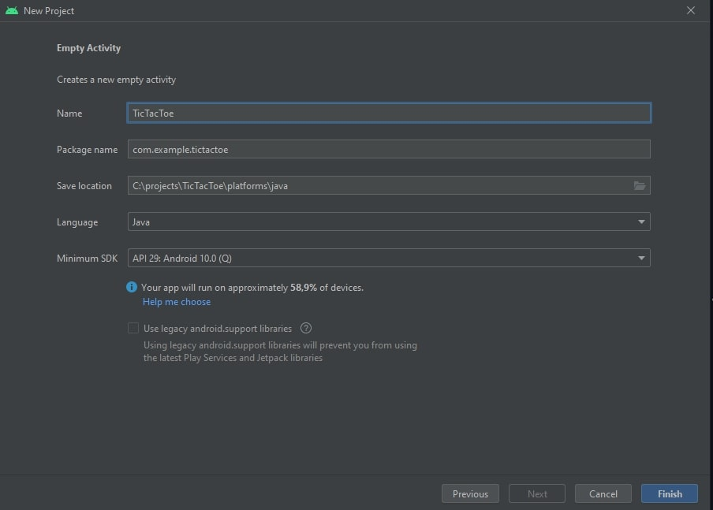

Один из способов добавление зависимостей напрямую записать эту зависимость в *build.gradle*. В формате отображения
проекта как Android проект, нужный нам файл будет в разделе Gradle Script -> build.gradle (Module: TicTacToe.app).

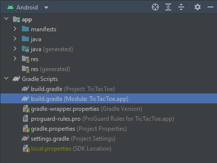

Открываем этот файл и добавляем в этот две зависимости в раздел dependencies. Зависимость на `kotlin-stdlib` не обходима
для того чтобы мы из java подписываться на события. Но так как при компиляции kotlin лямбда функции превращаются в
интерфейс, в нашем случае интерфейс `Function1`, необходимо создать экземпляр реализации этого интерфейса, но
без `kotlin-stdlib` этот интерфейс недоступен, а это значит подписаться мы не сможем, а без подписки наша игра работать
не будет. Если нет возможности добавить зависимость на `kotlin-stdlib` то при реализации `IEventEmitter` стоит принимать
не лямбду, а интерфейс который будет реализован на каждой платформе.

```groovy
// ...
dependencies {
    // Добавляем зависимость на наш SDK
    implementation files('../../../core/build/libs/core-jvm-1.0.0.jar')
    // Добавляем зависимость для совместимости Kotlin лямбд
    implementation 'org.jetbrains.kotlin:kotlin-stdlib:1.7.10'
    // ...
}
```

Средствами ide или командой gradle обновляем зависимости, чтобы при написании кода ide понимала класс которые находятся
в наших зависимостях.

```bash
gradle --refresh-dependencies
```

Далее накидываем простой интерфейс с кнопкой играть и перезапуска, и текстовым полем для вывода сообщений. Кнопки
игрового поля создадим динамически.

```xml
<?xml version="1.0" encoding="utf-8"?>
<androidx.constraintlayout.widget.ConstraintLayout xmlns:android="http://schemas.android.com/apk/res/android"
                                                   xmlns:app="http://schemas.android.com/apk/res-auto"
                                                   xmlns:tools="http://schemas.android.com/tools"
                                                   android:layout_width="match_parent"
                                                   android:layout_height="match_parent"
                                                   tools:context=".MainActivity">

    <LinearLayout
            android:id="@+id/mainLinearLayout"
            android:layout_width="match_parent"
            android:layout_height="match_parent"
            android:orientation="vertical">

        <LinearLayout
                android:id="@+id/fieldLinearLayout"
                android:visibility="invisible"
                android:layout_width="match_parent"
                android:layout_height="wrap_content"
                android:orientation="vertical">
            <!-- Сюда будем динамически добавлять кнопки -->
        </LinearLayout>


        <!-- Кнопка запуска игры -->
        <Button
                android:id="@+id/buttonPlay"
                android:layout_width="match_parent"
                android:layout_height="wrap_content"
                android:text="@string/play"/>

        <!-- Сообщение и победителе -->
        <TextView
                android:id="@+id/textWinner"
                android:layout_width="match_parent"
                android:layout_height="wrap_content"
                android:textAlignment="center"
                android:textSize="32sp"
                android:visibility="invisible"/>

        <!-- Кнопка перезапуска игры -->
        <Button
                android:id="@+id/buttonPlayAgain"
                android:visibility="invisible"
                android:layout_width="match_parent"
                android:layout_height="wrap_content"
                android:text="@string/play_again"/>

    </LinearLayout>
</androidx.constraintlayout.widget.ConstraintLayout>
```

И создаем простую реализацию на Java. Суть которого заключается в том же в чем и на предыдущих платформах, создать мост
между представлением и SDK. Если чуть подробнее, то данный класс реализует такие функции как:

- Создание поля из кнопок. И передача события клика кнопки соответствующей ячейки в SDK.
- Подписка на события SDK. И обновление представления в соответствии с этими событиями.

```java
package com.example.tictactoe;

import androidx.annotation.NonNull;
import androidx.appcompat.app.AppCompatActivity;

import android.os.Bundle;
import android.util.TypedValue;
import android.view.View;
import android.view.ViewGroup;
import android.widget.Button;
import android.widget.LinearLayout;
import android.widget.TextView;

import org.rubicon.game.impl.FieldCell;
import org.rubicon.game.impl.Game;
import org.rubicon.game.impl.events.GameCellEvent;
import org.rubicon.game.impl.events.GameEventType;
import org.rubicon.game.impl.events.GameOverEvent;

import java.util.LinkedHashMap;

import kotlin.Unit;
import kotlin.jvm.functions.Function1;

public class MainActivity extends AppCompatActivity {
    // Сразу создаем экземпляр игры при создании объекта
    final private Game game = new Game();
    // Здесь сохраним кнопки чтобы было удобнее к ним обращаться и менять значение
    final private LinkedHashMap<String, Button> uiButtons = new LinkedHashMap<>();

    // Точка взхода в View
    @Override
    protected void onCreate(Bundle savedInstanceState) {
        super.onCreate(savedInstanceState);
        setContentView(R.layout.activity_main);

        // Создаем поле
        this.createButtons();

        // По клику запуска подписываеся на события игры и запускаем игру
        final Button buttonPlay = findViewById(R.id.buttonPlay);
        buttonPlay.setOnClickListener(v -> {
            game.on(GameEventType.GAME_OVER, onGameOver);
            game.on(GameEventType.CHANGE_CELL, onGameCellChange);
            game.play();
            buttonPlay.setVisibility(View.INVISIBLE);
            findViewById(R.id.fieldLinearLayout).setVisibility(View.VISIBLE);
        });

        // По клику кнопки играть опять перезапускаем игру
        final Button buttonPlayAgain = findViewById(R.id.buttonPlayAgain);
        buttonPlayAgain.setOnClickListener(v -> {
            findViewById(R.id.textWinner).setVisibility(View.INVISIBLE);
            game.reset();
            buttonPlayAgain.setVisibility(View.INVISIBLE);
        });
    }

    // Подписка на окончание игры
    private final Function1 onGameOver = o -> {
        // Получаем информацию о победителе
        final GameOverEvent event = (GameOverEvent) o;
        String winnerMessage = "";
        switch (event.getWinner()) {
            case NONE:
                winnerMessage = "Ничья";
                break;
            case ZERO:
                winnerMessage = "Выиграли O";
                break;
            case CROSS:
                winnerMessage = "Выиграли X";
                break;
        }
        // Отображаем на экране
        final TextView textView = findViewById(R.id.textWinner);
        textView.setText(winnerMessage);
        textView.setVisibility(View.VISIBLE);
        findViewById(R.id.buttonPlayAgain).setVisibility(View.VISIBLE);
        return Unit.INSTANCE;
    };

    // Подписка на изменение состояния ячейки игрового поля
    private final Function1 onGameCellChange = o -> {
        // Получаем информацию о ячейке
        final GameCellEvent event = (GameCellEvent) o;
        final FieldCell fieldCell = event.getFieldCell();
        final String hash = makeHash(fieldCell.getX(), fieldCell.getY());
        // Далее обновляем соответввующую кнопку
        final Button uiButton = this.uiButtons.get(hash);
        if (uiButton == null) {
            return Unit.INSTANCE;
        }
        if (!uiButton.hasOnClickListeners()) {
            uiButton.setOnClickListener(view -> {
                fieldCell.click();
            });
        }
        switch (event.getFieldCell().getState()) {
            case NONE:
                uiButton.setText("");
                break;
            case ZERO:
                uiButton.setText("O");
                break;
            case CROSS:
                uiButton.setText("X");
                break;
        }
        return Unit.INSTANCE;
    };

    @NonNull
    private String makeHash(int x, int y) {
        return String.format("%s-%s", x, y);
    }

    // Создаем игровое поле
    private void createButtons() {
        final LinearLayout rowLayout = findViewById(R.id.fieldLinearLayout);
        for (int y = 0; y < 3; y++) {
            final LinearLayout row = new LinearLayout(this);
            for (int x = 0; x < 3; x++) {
                final Button button = new Button(this);
                button.setTextSize(TypedValue.COMPLEX_UNIT_SP, 64);
                row.addView(button, new LinearLayout.LayoutParams(
                        ViewGroup.LayoutParams.WRAP_CONTENT,
                        ViewGroup.LayoutParams.WRAP_CONTENT,
                        1.0f
                ));
                // Сохраняем ссылку на кнопку для более простого поиска в дальнейшем
                uiButtons.put(makeHash(x, y), button);
            }
            rowLayout.addView(row, new LinearLayout.LayoutParams(
                    ViewGroup.LayoutParams.MATCH_PARENT,
                    ViewGroup.LayoutParams.WRAP_CONTENT
            ));
        }
    }
}
```

Запускаем наше приложение. Проверяем. Все работает.


## Итог

По итогу мы реализовали 3 приложения с единой бизнес логикой. И при желании внести изменение в логику мы с легкостью это
сделаем в общем коде. И все что нужно будет сделать в самих приложениях чтобы появились эти изменения это просто
обновить версию SDK и пересобрать. Или если мы захотим реализовать еще приложение под какую-то платформу из
перечисленных на [сайте](https://kotlinlang.org/docs/multiplatform-dsl-reference.html#targets), все что нам нужно будет
сделать это добавить параметры сборки под эту платформу и реализовать представление на этой платформе.

Общую логику можно вынести из практически любых приложений реализованных на нескольких платформ, от доставки суши и до
социальной сети. Даже если у вас идеальный API все равное будет некоторый условный класс User у которого должны быть
некоторые характеристики и методы взаимодействия с другими классами. И тем более актуален вынос логики для проектов со
сложной бизнес логикой которая считается на клиенте.

Я надеюсь я достаточно ввел в курс дело технологии Kotlin Multiplatform, и прочтя эту статью и посмотрев пример работы
вы поймете нужна вам эта технология или нет на вашем проекте.

P.S. Если остаются какие-то вопросы пишите в комментарии, постараюсь ответить.